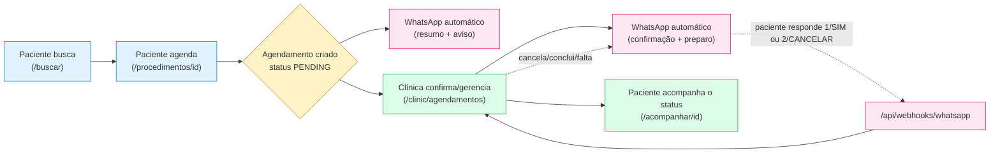

#arquitetura #visao-geral

> [!info] Sobre esta nota
> Ponto de entrada da documentação técnica do **Marcação** (plataforma de agendamento de consultas e exames). Ligada a: [[01 - Setup e Infraestrutura]] · [[02 - Dicionário de Dados e Banco]] · [[03 - APIs e Webhooks n8n]] · [[04 - Manual de Edição Manual e Manutenção]] · [[05 - Módulo de Atendimento e Chat Realtime]]

## O que é

Plataforma de agendamento de consultas médicas e exames (laboratoriais, de imagem e outros), com três áreas distintas na mesma aplicação:

- **Pública** (`/`, `/buscar`, `/procedimentos/[id]`, `/acompanhar/[id]`) — o paciente busca, compara preços/avaliações, agenda (sem precisar de conta) e acompanha o status pelo link recebido na confirmação.
- **Clínica** (`/clinic`, login obrigatório) — agenda do dia/semana, lista de agendamentos com filtro por status e ações rápidas de confirmação/conclusão/falta, tabela de preços e horário de atendimento, e um inbox de atendimento (`/clinic/inbox`) para conversar com pacientes pelo WhatsApp direto do painel — ver [[05 - Módulo de Atendimento e Chat Realtime]].
- **Admin** (`/admin`, login obrigatório) — gestão de clínicas parceiras e comissionamento, relatório financeiro, KPIs (pedidos, conversão, procedimentos mais buscados).

> [!success] Estado atual do projeto
> O fluxo principal está funcional de ponta a ponta, incluindo notificação: busca pública → agendamento sem conta → WhatsApp automático → login da clínica → confirmação/gestão do agendamento → WhatsApp automático de novo → paciente responde pelo WhatsApp → relatório no admin. A equipe da clínica também pode conversar com o paciente pelo mesmo número, direto do inbox (`/clinic/inbox`), com respostas rápidas, tags e um atalho para criar agendamento sem sair da conversa — ver [[05 - Módulo de Atendimento e Chat Realtime]]. O que **ainda não existe** é o cadastro de novos procedimentos no catálogo global pela UI (ainda depende do Prisma Studio), o envio de WhatsApp de fato sair da caixa (funciona sem provedor configurado, só loga o que seria enviado — ver [[03 - APIs e Webhooks n8n]]) e a sincronização do inbox em tempo real via Supabase Realtime (código pronto, rodando por polling enquanto as credenciais não existem — ver [[05 - Módulo de Atendimento e Chat Realtime]]). Cada nota marca explicitamente o que é real versus proposta.

## Stack tecnológica

| Camada | Tecnologia | Status |
|---|---|---|
| Framework | Next.js 15 (App Router, TypeScript) | ✅ Implementado |
| UI | Tailwind CSS v3 + shadcn/ui | ✅ Implementado (9 componentes base) |
| Banco de dados | PostgreSQL (Supabase) + Prisma ORM v5 | ✅ Migrado e populado — ver [[02 - Dicionário de Dados e Banco]] |
| Validação | Zod + React Hook Form | ✅ Implementado (busca, agendamento, login, painéis) |
| Autenticação | NextAuth v4 (JWT/Credentials) | ✅ Implementado — ver [[03 - APIs e Webhooks n8n]] |
| Automação/Notificações | WhatsApp direto (Evolution API/UAZAPI/Z-API) | ✅ Implementado, sem n8n — ver [[03 - APIs e Webhooks n8n]] |
| Chat/Inbox em tempo real | Supabase Realtime (`@supabase/supabase-js`) + polling | 🚧 Polling funcional hoje; Realtime pronto no código, falta credencial — ver [[05 - Módulo de Atendimento e Chat Realtime]] |
| Testes | Vitest (unitários + integração) | ✅ Implementado — ver [[04 - Manual de Edição Manual e Manutenção]] |
| Hospedagem | Vercel, ou Docker Compose auto-hospedado | 🚧 Vercel não configurado · ✅ `docker-compose.prod.yml` (App + Postgres + Nginx) pronto, não testado com Docker de verdade — ver [[01 - Setup e Infraestrutura]] |
| Infra local | Docker + docker-compose (Postgres) | ✅ Implementado (dev atual usa Supabase — ver [[01 - Setup e Infraestrutura]]) |

Next.js foi fixado na major 15 (não a 14, que tem CVEs de segurança altas sem correção retroativa; nem a 16, que trouxe breaking changes grandes). Prisma foi fixado na major 5 pelo mesmo motivo de estabilidade — a 6/7 mudam a forma de gerar o client e carregar variáveis de ambiente. Pelo mesmo raciocínio, a autenticação usa **NextAuth v4** (estável), não a v5/Auth.js — que segue em beta (`5.0.0-beta.32` era a versão mais recente disponível) sem nunca ter chegado a uma versão estável.

## Estrutura de pastas

```
MARCACAO/
├── prisma/
│   ├── schema.prisma           # Modelos do banco — ver [[02 - Dicionário de Dados e Banco]]
│   ├── seed.ts                 # Dados de exemplo + usuários de teste — ver [[01 - Setup e Infraestrutura]]
│   └── migrations/             # Histórico de migrações — ver [[01 - Setup e Infraestrutura]]
├── docs/obsidian/               # Esta documentação
├── src/
│   ├── middleware.ts            # Bloqueia /admin e /clinic por role — ver [[03 - APIs e Webhooks n8n]]
│   ├── app/
│   │   ├── layout.tsx           # Layout raiz (fontes, SessionProvider, Toaster)
│   │   ├── globals.css          # Tema shadcn/ui (variáveis CSS, tokens de cor)
│   │   ├── api/
│   │   │   ├── auth/[...nextauth]/route.ts        # Rota do NextAuth
│   │   │   └── webhooks/whatsapp/route.ts          # Recebe resposta do paciente + ingestão de chat — ver [[05 - Módulo de Atendimento e Chat Realtime]]
│   │   ├── (public)/            # Área pública — grupo de rotas, não aparece na URL
│   │   │   ├── layout.tsx       # Header simples
│   │   │   ├── page.tsx         # Landing page ("/") com busca e destaques
│   │   │   ├── entrar/page.tsx  # Login (admin e clínica)
│   │   │   ├── buscar/page.tsx  # Resultados de busca com filtros
│   │   │   ├── procedimentos/[id]/page.tsx   # Detalhe + agendamento
│   │   │   └── acompanhar/[id]/page.tsx      # Status do agendamento
│   │   ├── (admin)/
│   │   │   ├── layout.tsx       # Nav "Painel Administrativo" + Sair
│   │   │   └── admin/
│   │   │       ├── dashboard/page.tsx    # KPIs
│   │   │       ├── clinicas/page.tsx     # Gestão de clínicas + comissão
│   │   │       └── relatorio/page.tsx    # Relatório financeiro
│   │   └── (clinic)/
│   │       ├── layout.tsx       # Nav "Painel da Clínica" + Sair
│   │       └── clinic/
│   │           ├── dashboard/page.tsx      # Visão geral + agenda do dia
│   │           ├── agendamentos/page.tsx   # Lista completa com filtro de status
│   │           ├── precos/page.tsx         # Tabela de preços + horários
│   │           └── inbox/page.tsx          # Chat/CRM — ver [[05 - Módulo de Atendimento e Chat Realtime]]
│   ├── components/
│   │   ├── ui/                  # Componentes shadcn/ui (button, card, dialog, table, form...)
│   │   ├── public/               # Busca, resultado, modal de agendamento, estrelas
│   │   ├── clinic/               # Ações rápidas de status, filtro de status
│   │   ├── inbox/                # Colunas do chat, bolha de mensagem, painel de contato — ver [[05 - Módulo de Atendimento e Chat Realtime]]
│   │   ├── session-provider.tsx  # Wrapper client do `SessionProvider` do NextAuth
│   │   └── sign-out-button.tsx   # Botão "Sair"
│   ├── lib/
│   │   ├── prisma.ts             # Singleton do Prisma Client
│   │   ├── auth.ts                # Config do NextAuth (Credentials + JWT)
│   │   ├── session.ts             # `requireClinicSession()` / `requireAdminSession()`
│   │   ├── whatsapp.ts             # WhatsAppService (envio, retry, log) — ver [[03 - APIs e Webhooks n8n]]
│   │   ├── whatsapp-templates.ts   # Texto de cada mensagem por status
│   │   ├── supabase-client.ts      # Cliente Supabase Realtime (null se env vars ausentes) — ver [[05 - Módulo de Atendimento e Chat Realtime]]
│   │   ├── notification-sound.ts   # Bipe sintetizado (Web Audio API) p/ mensagem nova no inbox
│   │   ├── schemas/               # Schemas Zod (appointment, auth, clinic, admin, inbox) + testes unitários
│   │   ├── format.ts              # Formatação pt-BR (moeda, data, labels de enum)
│   │   ├── date.ts                # Helpers de data em UTC
│   │   ├── serialize.ts           # Converte `Decimal` do Prisma em `number` p/ Client Components
│   │   └── utils.ts               # Helper `cn()` (clsx + tailwind-merge)
│   ├── hooks/
│   │   ├── use-action-feedback.ts  # Loading + toast padronizados p/ Server Actions em forms
│   │   └── use-inbox-realtime.ts   # Polling 5s + Supabase Realtime opcional — ver [[05 - Módulo de Atendimento e Chat Realtime]]
│   ├── actions/                  # Server Actions — ver [[03 - APIs e Webhooks n8n]]
│   │   ├── search.ts
│   │   ├── appointments.ts         # + appointments.test.ts (integração)
│   │   ├── clinic.ts
│   │   ├── admin.ts
│   │   └── inbox.ts                # Conversas, mensagens, tags, respostas rápidas — ver [[05 - Módulo de Atendimento e Chat Realtime]]
│   └── types/
│       ├── index.ts              # Re-exporta enums do Prisma
│       └── next-auth.d.ts        # Augmenta `Session`/`JWT` com `role`/`clinicId`
├── deploy/
│   └── nginx.conf                # Reverse proxy usado pelo docker-compose.prod.yml
├── Dockerfile                    # Build multi-stage da aplicação — ver [[01 - Setup e Infraestrutura]]
├── docker-compose.yml            # Sobe só o PostgreSQL (dev local)
├── docker-compose.prod.yml       # Deploy completo: App + Postgres + Nginx — ver [[01 - Setup e Infraestrutura]]
├── vitest.config.mts             # Config dos testes — ver [[04 - Manual de Edição Manual e Manutenção]]
├── .env.example                  # Variáveis de ambiente (dev) — ver [[01 - Setup e Infraestrutura]]
└── .env.prod.example             # Variáveis de ambiente (docker-compose.prod.yml)
```

**Por que route groups (`(public)`, `(admin)`, `(clinic)`)?** No App Router do Next.js, pastas entre parênteses organizam o código sem afetar a URL. Por isso `(admin)/admin/dashboard` e `(clinic)/clinic/dashboard` precisam de um segmento real (`admin/`, `clinic/`) dentro do grupo — sem isso as duas rotas colidiriam em `/dashboard`.

## Fluxo do paciente (o que é real hoje)

O fluxo abaixo é **real** de ponta a ponta, incluindo a notificação por WhatsApp (funciona sem provedor configurado — só fica registrada em `WebhookLog` em vez de sair de fato, ver [[03 - APIs e Webhooks n8n]]). O paciente nunca precisa criar conta — o link de acompanhamento (com o `id` do agendamento) é o único "código de acesso".



> [!note] Modelo de dados por trás do fluxo
> O agendamento (`Appointment`) tem status `PENDING → CONFIRMED → COMPLETED`, com `CANCELLED` e `NO_SHOW` como saídas alternativas a partir de `PENDING`/`CONFIRMED` (ver [[02 - Dicionário de Dados e Banco]]). A troca de status acontece de duas formas: a equipe da clínica em `/clinic/agendamentos`/`/clinic/dashboard` (botões `AppointmentActions`), ou o próprio paciente respondendo a mensagem de WhatsApp (`1`/`SIM` confirma, `2`/`CANCELAR` cancela) — ver [[03 - APIs e Webhooks n8n]] e [[04 - Manual de Edição Manual e Manutenção]].

> [!note] O mesmo número de WhatsApp também vira conversa no inbox
> Toda mensagem recebida pelo webhook (`H` no diagrama acima) — não só `1`/`SIM`/`2`/`CANCELAR` — também vira uma mensagem numa conversa em `/clinic/inbox`, onde a equipe pode responder livremente, com respostas rápidas e tags. Ver [[05 - Módulo de Atendimento e Chat Realtime]] para o fluxo completo.

## Próximas notas

- [[01 - Setup e Infraestrutura]] — como rodar o projeto localmente
- [[02 - Dicionário de Dados e Banco]] — schema completo do Prisma
- [[03 - APIs e Webhooks n8n]] — rotas, Server Actions e integração direta de WhatsApp
- [[04 - Manual de Edição Manual e Manutenção]] — guia de operação do dia a dia
- [[05 - Módulo de Atendimento e Chat Realtime]] — inbox de chat/CRM, Supabase Realtime e respostas rápidas
