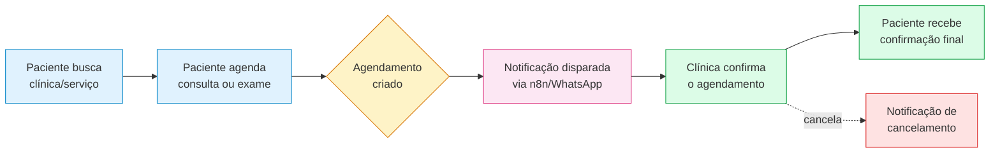

#arquitetura #visao-geral

> [!info] Sobre esta nota
> Ponto de entrada da documentação técnica do **Marcação** (plataforma de agendamento de consultas e exames). Ligada a: [[01 - Setup e Infraestrutura]] · [[02 - Dicionário de Dados e Banco]] · [[03 - APIs e Webhooks n8n]] · [[04 - Manual de Edição Manual e Manutenção]]

## O que é

Plataforma de agendamento de consultas médicas e exames (laboratoriais, de imagem e outros), com três áreas distintas na mesma aplicação:

- **Pública** — landing page onde o paciente busca e agenda consultas/exames.
- **Admin** — painel administrativo da plataforma (visão sobre clínicas, consultas e exames).
- **Clínica** — painel usado pela equipe de cada clínica parceira (agenda do dia).

> [!warning] Estado atual do projeto
> Este é um **scaffold inicial**. As três áreas existem como rotas e layouts funcionais, mas hoje mostram dados estáticos/vazios — ainda não há autenticação, formulários de cadastro, nem integrações externas (webhooks, WhatsApp, n8n) implementadas. Cada nota desta documentação marca claramente o que já existe versus o que é proposta para implementação futura.

## Stack tecnológica

| Camada | Tecnologia | Status |
|---|---|---|
| Framework | Next.js 15 (App Router, TypeScript) | ✅ Implementado |
| UI | Tailwind CSS v3 + shadcn/ui | ✅ Implementado (9 componentes base) |
| Banco de dados | PostgreSQL (Supabase) + Prisma ORM v5 | ✅ Migrado e populado — ver [[02 - Dicionário de Dados e Banco]] |
| Validação | Zod + React Hook Form | 🚧 Planejado, ainda não instalado |
| Autenticação | NextAuth (JWT/Credentials) | 🚧 Planejado, ainda não instalado |
| Automação/Notificações | n8n + WhatsApp | 🚧 Planejado, ver [[03 - APIs e Webhooks n8n]] |
| Hospedagem | Vercel | 🚧 Planejado, ainda não configurado |
| Infra local | Docker + docker-compose (Postgres) | ✅ Implementado (dev atual usa Supabase — ver [[01 - Setup e Infraestrutura]]) |

Next.js foi fixado na major 15 (não a 14, que tem CVEs de segurança altas sem correção retroativa; nem a 16, que trouxe breaking changes grandes). Prisma foi fixado na major 5 pelo mesmo motivo de estabilidade — a 6/7 mudam a forma de gerar o client e carregar variáveis de ambiente.

## Estrutura de pastas

```
MARCACAO/
├── prisma/
│   └── schema.prisma          # Modelos do banco — ver [[02 - Dicionário de Dados e Banco]]
├── docs/obsidian/              # Esta documentação
├── src/
│   ├── app/
│   │   ├── layout.tsx          # Layout raiz (fontes, metadata global)
│   │   ├── globals.css         # Tema shadcn/ui (variáveis CSS, tokens de cor)
│   │   ├── (public)/           # Área pública — grupo de rotas, não aparece na URL
│   │   │   ├── layout.tsx      # Header simples
│   │   │   └── page.tsx        # Landing page ("/")
│   │   ├── (admin)/
│   │   │   ├── layout.tsx      # Sidebar "Painel Administrativo"
│   │   │   └── admin/dashboard/page.tsx   # Rota "/admin/dashboard"
│   │   └── (clinic)/
│   │       ├── layout.tsx      # Sidebar "Painel da Clínica"
│   │       └── clinic/dashboard/page.tsx  # Rota "/clinic/dashboard"
│   ├── components/ui/          # Componentes shadcn/ui (button, card, dialog, table...)
│   ├── lib/
│   │   ├── prisma.ts           # Singleton do Prisma Client
│   │   └── utils.ts            # Helper `cn()` (clsx + tailwind-merge)
│   ├── actions/
│   │   └── appointments.ts     # Server Actions — ver [[03 - APIs e Webhooks n8n]]
│   └── types/
│       └── index.ts            # Re-exporta enums do Prisma (UserRole, ProcedureCategory, AppointmentType, AppointmentStatus)
├── Dockerfile                  # Build multi-stage da aplicação — ver [[01 - Setup e Infraestrutura]]
├── docker-compose.yml          # Sobe o PostgreSQL local
└── .env.example                # Variáveis de ambiente — ver [[01 - Setup e Infraestrutura]]
```

**Por que route groups (`(public)`, `(admin)`, `(clinic)`)?** No App Router do Next.js, pastas entre parênteses organizam o código sem afetar a URL. Por isso `(admin)/admin/dashboard` e `(clinic)/clinic/dashboard` precisam de um segmento real (`admin/`, `clinic/`) dentro do grupo — sem isso as duas rotas colidiriam em `/dashboard`.

## Fluxo do paciente (visão atual + proposta)

O fluxo abaixo descreve a jornada completa **pretendida** do produto. Os passos "Busca" e "Agendamento" já têm uma tela (estática); "Notificação" e "Confirmação da Clínica" ainda não têm implementação — dependem do painel administrativo, autenticação e da integração n8n descritos em [[03 - APIs e Webhooks n8n]] e [[04 - Manual de Edição Manual e Manutenção]].



> [!note] Modelo de dados por trás do fluxo
> O agendamento (`Appointment`) já existe no schema, migrado e populado com dados de exemplo, com status `PENDING → CONFIRMED/COMPLETED/CANCELLED`. O que falta é a camada que dispara e reage a essas mudanças de status (webhooks, UI de confirmação). Detalhes em [[02 - Dicionário de Dados e Banco]] e [[03 - APIs e Webhooks n8n]].

## Próximas notas

- [[01 - Setup e Infraestrutura]] — como rodar o projeto localmente
- [[02 - Dicionário de Dados e Banco]] — schema completo do Prisma
- [[03 - APIs e Webhooks n8n]] — rotas, Server Actions e proposta de integração n8n
- [[04 - Manual de Edição Manual e Manutenção]] — guia de operação do dia a dia
