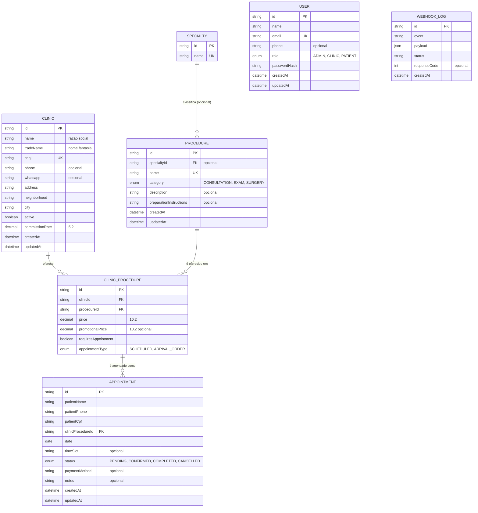

#banco-de-dados #arquitetura

> [!info] Sobre esta nota
> Reflete exatamente o `prisma/schema.prisma` atual. Parte de [[00 - Visão Geral]]. Para os comandos de migração, ver [[01 - Setup e Infraestrutura]]. Para como editar esses dados manualmente, ver [[04 - Manual de Edição Manual e Manutenção]].

> [!success] Migrado e populado
> A migração `20260815230834_init_healthcare_schema` foi aplicada com sucesso contra o Postgres do Supabase, e o seed (`prisma/seed.ts`) já rodou: 3 clínicas, 4 especialidades, 9 procedimentos e 12 vínculos clínica×procedimento estão no banco.

> [!warning] Segunda versão do schema — domínio de saúde
> Este schema **substituiu** um desenho anterior (que tinha `Doctor`/`Patient` como entidades e vínculo direto `Appointment → Clinic`). O modelo atual não tem contas de paciente: dados do paciente ficam embutidos no próprio `Appointment` (`patientName`, `patientPhone`, `patientCpf`), e o preço/tipo de agendamento vivem em `ClinicProcedure`, não em `Appointment` nem em `Procedure` diretamente.

## Convenção de nomes

Modelos em PascalCase no Prisma (`User`, `Appointment`...), mapeados via `@@map` para tabelas em `snake_case` no PostgreSQL (`users`, `appointments`...) — conforme diretriz do projeto de "nomes de tabelas em inglês no banco, interface em português". Campos seguem o mesmo padrão com `@map` (`passwordHash` → `password_hash`).

## Diagrama relacional

`User` e `WebhookLog` não aparecem ligados a nada no diagrama porque hoje **não têm nenhuma relação declarada** com o resto do schema — `User` é uma conta de acesso solta (sem FK para `Clinic`, mesmo para quem tem `role = CLINIC`), e `WebhookLog` é uma tabela de auditoria independente (ver [[03 - APIs e Webhooks n8n]]).

## Enums

### `UserRole` (tabela `user_role`)
| Valor | Significado |
|---|---|
| `ADMIN` | Administrador da plataforma |
| `CLINIC` | Usuário de uma clínica parceira |
| `PATIENT` | Paciente — valor padrão de `User.role` |

### `ProcedureCategory` (tabela `procedure_category`)
| Valor | Significado |
|---|---|
| `CONSULTATION` | Consulta médica |
| `EXAM` | Exame (laboratorial, imagem, etc.) |
| `SURGERY` | Procedimento cirúrgico |

### `AppointmentType` (tabela `appointment_type`)
| Valor | Significado |
|---|---|
| `SCHEDULED` | Agendamento com data/horário marcado |
| `ARRIVAL_ORDER` | Atendimento por ordem de chegada, sem horário fixo |

### `AppointmentStatus` (tabela `appointment_status`)
| Valor | Significado |
|---|---|
| `PENDING` | Agendado, aguardando confirmação (padrão ao criar) |
| `CONFIRMED` | Confirmado pela clínica |
| `COMPLETED` | Atendimento realizado |
| `CANCELLED` | Cancelado |

## Tabelas

### `users` (model `User`)
Conta de acesso genérica — o papel (`role`) define o que o usuário pode fazer. Não tem hoje nenhuma FK para `Clinic` (ver aviso acima).

| Campo | Tipo | Constraints | Descrição |
|---|---|---|---|
| `id` | `String` | PK, `cuid()` | — |
| `name` | `String` | — | Nome |
| `email` | `String` | **único** | Login |
| `phone` | `String?` | opcional | Telefone |
| `role` | `UserRole` | default `PATIENT` | Papel do usuário |
| `passwordHash` | `String` | — | Hash da senha — autenticação (NextAuth) ainda não implementada |
| `createdAt` / `updatedAt` | `DateTime` | auto | — |

### `clinics` (model `Clinic`)
Clínica parceira (tenant), agora com dados cadastrais completos (CNPJ, endereço) e taxa de comissão própria.

| Campo | Tipo | Constraints | Descrição |
|---|---|---|---|
| `id` | `String` | PK | — |
| `name` | `String` | — | Razão social |
| `tradeName` | `String` | — | Nome fantasia (usado nas telas) |
| `cnpj` | `String` | **único** | CNPJ |
| `phone` | `String?` | opcional | Telefone fixo |
| `whatsapp` | `String?` | opcional | Número de WhatsApp — usado nas notificações propostas em [[03 - APIs e Webhooks n8n]] |
| `address` | `String` | — | Logradouro e número |
| `neighborhood` | `String` | — | Bairro |
| `city` | `String` | — | Cidade |
| `active` | `Boolean` | default `true` | Clínica ativa na plataforma |
| `commissionRate` | `Decimal(5,2)` | — | Percentual de comissão da plataforma sobre essa clínica |
| `createdAt` / `updatedAt` | `DateTime` | auto | — |

Relação: `clinicProcedures[]` — os procedimentos que essa clínica oferece, com preço próprio (ver `ClinicProcedure` abaixo).

> [!note] Comissão agora é nativa do schema
> Diferente da versão anterior desta nota, `commissionRate` já existe em `Clinic` — não é mais necessário migrar nada para registrar comissão por clínica (ver [[04 - Manual de Edição Manual e Manutenção]]). Uma comissão *por procedimento* ou *por médico*, se vier a ser necessária, ainda exigiria uma migração nova.

### `specialties` (model `Specialty`)
Catálogo simples de especialidades médicas, usado para classificar procedimentos de consulta.

| Campo | Tipo | Constraints | Descrição |
|---|---|---|---|
| `id` | `String` | PK | — |
| `name` | `String` | **único** | Ex: "Cardiologia" |

Relação: `procedures[]`.

### `procedures` (model `Procedure`)
Catálogo global de consultas/exames/cirurgias — independe de clínica. O preço e a forma de agendamento ficam em `ClinicProcedure`, não aqui.

| Campo | Tipo | Constraints | Descrição |
|---|---|---|---|
| `id` | `String` | PK | — |
| `specialtyId` | `String?` | FK opcional → `specialties.id` | Só faz sentido para `category = CONSULTATION`; exames hoje não têm especialidade vinculada no seed |
| `name` | `String` | **único** | Ex: "Colonoscopia" |
| `category` | `ProcedureCategory` | — | Ver enum acima |
| `description` | `String?` | opcional | Descrição para o paciente |
| `preparationInstructions` | `String?` | opcional | Instruções de preparo/jejum — ex: "Jejum de 8 horas" |
| `createdAt` / `updatedAt` | `DateTime` | auto | — |

> [!note] Regras de jejum já têm campo próprio
> `preparationInstructions` cobre o caso de "regras de jejum" citado em [[04 - Manual de Edição Manual e Manutenção]] — não é um campo dedicado só a jejum, é texto livre para qualquer instrução de preparo.

### `clinic_procedures` (model `ClinicProcedure`)
Tabela de associação — **é aqui que vivem preço e forma de agendamento**, porque a mesma `Procedure` pode ter preços e regras diferentes em cada clínica.

| Campo | Tipo | Constraints | Descrição |
|---|---|---|---|
| `id` | `String` | PK | — |
| `clinicId` | `String` | FK → `clinics.id` | — |
| `procedureId` | `String` | FK → `procedures.id` | — |
| `price` | `Decimal(10,2)` | — | Preço cheio |
| `promotionalPrice` | `Decimal(10,2)?` | opcional | Preço promocional, quando houver |
| `requiresAppointment` | `Boolean` | default `true` | Se `false`, é atendimento livre (ex: exame por ordem de chegada sem reserva prévia) |
| `appointmentType` | `AppointmentType` | default `SCHEDULED` | `SCHEDULED` ou `ARRIVAL_ORDER` |

Constraint: `@@unique([clinicId, procedureId])` — uma clínica não pode ter duas entradas para o mesmo procedimento.

Relação: `appointments[]`.

### `appointments` (model `Appointment`)
O agendamento em si. Não referencia `User`/`Patient` — os dados do paciente são capturados diretamente no agendamento (fluxo sem conta obrigatória).

| Campo | Tipo | Constraints | Descrição |
|---|---|---|---|
| `id` | `String` | PK | — |
| `patientName` | `String` | — | Nome do paciente |
| `patientPhone` | `String` | — | Telefone do paciente — usado na notificação (ver [[03 - APIs e Webhooks n8n]]) |
| `patientCpf` | `String` | — | CPF do paciente |
| `clinicProcedureId` | `String` | FK → `clinic_procedures.id` | Define clínica, procedimento e preço aplicado |
| `date` | `Date` | — | Data do agendamento |
| `timeSlot` | `String?` | opcional | Horário (ex: "14:30"); tende a ficar vazio quando `appointmentType = ARRIVAL_ORDER` |
| `status` | `AppointmentStatus` | default `PENDING` | Ver enum acima |
| `paymentMethod` | `String?` | opcional | Ex: "Dinheiro", "Cartão", "Convênio" — texto livre, não é enum |
| `notes` | `String?` | opcional | Observações |
| `createdAt` / `updatedAt` | `DateTime` | auto | — |

Índice: `@@index([clinicProcedureId, date])` — otimiza "agenda de um procedimento numa clínica em um período" (usada por `listUpcomingAppointments`, ver [[03 - APIs e Webhooks n8n]]).

### `webhook_logs` (model `WebhookLog`)
Registro de auditoria de eventos disparados (ou a disparar) para integrações externas.

| Campo | Tipo | Constraints | Descrição |
|---|---|---|---|
| `id` | `String` | PK | — |
| `event` | `String` | — | Ex: `"agendamento.criado"` |
| `payload` | `Json` | — | Corpo enviado/recebido |
| `status` | `String` | — | Texto livre, ex: `"SUCCESS"` / `"FAILED"` (não é enum) |
| `responseCode` | `Int?` | opcional | Código HTTP de resposta do destino |
| `createdAt` | `DateTime` | auto | — |

> [!warning] Tabela existe, mas nada grava nela ainda
> `WebhookLog` está pronta no banco, mas nenhum código da aplicação escreve nela hoje — é infraestrutura para quando a integração com n8n (proposta em [[03 - APIs e Webhooks n8n]]) for implementada de fato.

## Notas relacionadas

- [[00 - Visão Geral]]
- [[01 - Setup e Infraestrutura]]
- [[03 - APIs e Webhooks n8n]]
- [[04 - Manual de Edição Manual e Manutenção]]
