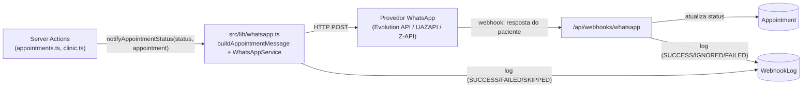

#whatsapp #arquitetura #api #autenticacao

> [!info] Sobre esta nota
> Parte de [[00 - Visão Geral]]. Modelos citados aqui estão detalhados em [[02 - Dicionário de Dados e Banco]]. As Server Actions e o webhook do inbox de chat (`src/actions/inbox.ts`) têm arquitetura detalhada em [[05 - Módulo de Atendimento e Chat Realtime]] — esta nota descreve só o essencial de API/rota.

> [!success] WhatsApp integrado diretamente — sem n8n
> A decisão inicial de usar n8n como intermediário (histórico ainda documentado mais abaixo) foi substituída por uma integração **direta**: a aplicação chama a API do provedor de WhatsApp e recebe respostas do paciente num webhook próprio, sem depender de uma ferramenta de automação externa. Ver seção "Integração de WhatsApp" abaixo.

## O que existe hoje

### Autenticação (NextAuth v4, Credentials + JWT)

- Rota: `src/app/api/auth/[...nextauth]/route.ts` — único Route Handler real do projeto, delega para `src/lib/auth.ts`.
- `src/lib/auth.ts`: `CredentialsProvider` que busca o `User` pelo `email`, compara a senha com `bcrypt.compare` contra `passwordHash`, e — se válido — inclui `role` e `clinicId` no JWT/sessão (via callbacks `jwt`/`session`).
- `src/middleware.ts`: protege `/admin/:path*` (exige `role === "ADMIN"`) e `/clinic/:path*` (exige `role === "CLINIC"`); redireciona para `/entrar` caso contrário.
- `src/app/(public)/entrar/page.tsx`: formulário de login (React Hook Form + Zod), chama `signIn("credentials", ...)` do `next-auth/react` e redireciona por `role` após sucesso.
- `src/lib/session.ts`: `requireClinicSession()` e `requireAdminSession()` — helpers usados **dentro de cada Server Action** para checar a sessão de novo (defesa em profundidade: o middleware protege a navegação de página, mas uma Server Action pode em tese ser chamada de qualquer lugar, e essas funções garantem que o `clinicId` usado numa query vem da sessão, nunca de um parâmetro que o cliente poderia adulterar).

Credenciais de teste em [[04 - Manual de Edição Manual e Manutenção]].

### Server Actions

Localizadas em `src/actions/`. São funções `"use server"` chamadas diretamente de Server/Client Components — não são endpoints HTTP com URL própria.

**`src/actions/search.ts`** (portal público, sem autenticação):
| Função | O que faz |
|---|---|
| `searchClinicProcedures(filters)` | Busca `ClinicProcedure` por texto livre (nome do procedimento, especialidade, clínica, bairro), categoria, tipo de atendimento, preço máximo e avaliação mínima |
| `getClinicProcedureDetail(id)` | Um `ClinicProcedure` com `clinic` e `procedure.specialty` incluídos, para a página de detalhes |

**`src/actions/appointments.ts`** (portal público + painel da clínica):
| Função | O que faz |
|---|---|
| `createAppointment(input)` | Valida com `createAppointmentSchema` (Zod, em `src/lib/schemas/appointment.ts`) e cria o `Appointment` — fluxo público, sem autenticação (é assim que o paciente agenda) |
| `getAppointmentById(id)` | Busca um agendamento pelo `id` — usado pela página `/acompanhar/[id]`. O `id` (um cuid longo, não adivinhável) funciona como "código de acesso" informal; não há verificação adicional de identidade |
| `listUpcomingAppointments(clinicId)` | Agendamentos futuros de uma clínica — usada internamente pelo painel da clínica |

**`src/actions/clinic.ts`** (exige `requireClinicSession()` — só quem logou como `CLINIC` acessa, e sempre para a própria `clinicId` da sessão):
| Função | O que faz |
|---|---|
| `getClinicInfo()` | Dados da clínica da sessão |
| `getClinicOverview()` | Contagens: agendamentos hoje, na semana, pendentes |
| `listClinicAppointments({ status? })` | Lista de agendamentos da clínica, com filtro opcional de status |
| `updateAppointmentStatus(id, status)` | Muda o status de um agendamento — confirma que o agendamento pertence à clínica da sessão antes de gravar |
| `listClinicProcedures()` / `listProceduresNotOffered()` | Tabela de preços atual da clínica, e o catálogo global menos o que ela já oferece |
| `updateClinicProcedure(id, formData)` / `addClinicProcedure(formData)` | Edita preço/promoção/tipo de atendimento de um item, ou adiciona um procedimento do catálogo à clínica |
| `updateClinicBusinessHours(formData)` | Grava `Clinic.businessHours` |

**`src/actions/admin.ts`** (exige `requireAdminSession()`):
| Função | O que faz |
|---|---|
| `listClinics()` | Todas as clínicas, para gestão |
| `updateClinic(id, formData)` | Edita `commissionRate` e `active` |
| `createClinic(formData)` | Cadastra uma nova clínica parceira |
| `getFinancialReport()` | Por clínica: total de agendamentos, concluídos, receita (soma do preço vigente dos concluídos) e comissão (`receita × commissionRate`) |
| `getKpis()` | Total de pedidos, taxa de conversão (`(CONFIRMED + COMPLETED) ÷ total`) e top 5 procedimentos mais agendados |

**`src/actions/inbox.ts`** (exige `requireClinicSession()`, sempre para a própria `clinicId` — ver [[05 - Módulo de Atendimento e Chat Realtime]] para o desenho completo):
| Função | O que faz |
|---|---|
| `listConversations(filter, search?)` | Lista conversas da clínica, filtradas por `mine`/`unassigned`/`all`/`resolved`, com contagem de não lidas |
| `getConversation(id)` | Detalhe de uma conversa com histórico completo de mensagens |
| `markConversationRead(id)` | Marca mensagens `INBOUND` como lidas (`readAt`) |
| `sendMessage(conversationId, content)` | Cria a mensagem `OUTBOUND` e chama `whatsappService.sendMessage` — mesmo serviço da seção abaixo |
| `assignConversationToMe` / `resolveConversation` / `reopenConversation` | Atribuição e ciclo de vida da conversa |
| `updateConversationTags(id, tags)` | Grava `Conversation.tags` |
| `listCannedResponses()` | Respostas rápidas globais + da clínica |
| `listClinicProceduresForAppointment()` | Catálogo de procedimentos da clínica, já serializado (`Decimal` → `number`), para o atalho "Criar Agendamento" dentro do inbox |

> [!warning] Relatório financeiro usa o preço **vigente**, não o preço no momento do agendamento
> `Appointment` não guarda o preço praticado no momento da criação — só referencia `clinicProcedureId`, cujo preço pode mudar depois (ver [[02 - Dicionário de Dados e Banco]]). `getFinancialReport()` calcula a receita com o preço *atual* de `ClinicProcedure`, então o relatório de meses passados fica impreciso se o preço mudou desde então. Corrigir isso exigiria guardar um "preço praticado" no próprio `Appointment` — não implementado.

> [!note] Por que via `clinicProcedure`?
> `Appointment` não tem `clinicId` direto — o vínculo com a clínica passa por `clinicProcedureId`. Por isso os filtros usam `clinicProcedure: { clinicId }` em vez de `clinicId` direto.

### Route Handlers (API REST)

| Rota | Método | O que faz |
|---|---|---|
| `src/app/api/auth/[...nextauth]/route.ts` | GET/POST | NextAuth (login) |
| `src/app/api/webhooks/whatsapp/route.ts` | POST | Recebe respostas do paciente via WhatsApp — ver abaixo |

## Integração de WhatsApp

Direta, sem n8n nem outro intermediário — a aplicação chama a API do provedor de WhatsApp para enviar, e recebe respostas num webhook próprio. Arquitetura desacoplada em 3 camadas:



### `src/lib/whatsapp.ts` — serviço de envio

Classe `WhatsAppService` (instância única exportada como `whatsappService`), lida em três variáveis de ambiente: `WHATSAPP_API_URL`, `WHATSAPP_API_KEY`, `WHATSAPP_INSTANCE_NAME` (dicionário completo em [[01 - Setup e Infraestrutura]]).

> [!warning] "Compatível com Evolution API / UAZAPI / Z-API" não é uma API única
> Os três provedores têm contratos HTTP genuinamente diferentes (endpoint, header de autenticação, nomes de campo — `number`/`text` vs `phone`/`message`, token no header vs na URL). Fingir uma única forma de request "compatível com todos" seria incorreto. Em vez disso, `WHATSAPP_PROVIDER` (`"evolution"` por padrão, ou `"uazapi"`/`"zapi"`) escolhe qual *builder* de requisição usar — cada um isolado numa função própria dentro de `buildProviderRequest()`. Trocar de provedor é mudar essa variável; o resto do serviço (retry, log, templates) é o mesmo.

Fluxo de `sendMessage(phone, text, event)`:
1. Se `WHATSAPP_API_URL`/`WHATSAPP_API_KEY`/`WHATSAPP_INSTANCE_NAME` não estiverem todos configurados, **não tenta enviar** — grava um `WebhookLog` com `status = "SKIPPED"` (contendo a mensagem que seria enviada) e retorna. É assim que o projeto roda hoje, sem WhatsApp configurado — ver [[04 - Manual de Edição Manual e Manutenção]] para como confirmar isso.
2. Normaliza o telefone para o formato internacional (`55` + DDD + número — o resto do app guarda só DDD+número).
3. Tenta enviar via `fetch`, até **3 tentativas**, com espera crescente entre elas (1s, depois 2s).
4. Grava um `WebhookLog` com o resultado final: `event` (ex: `"appointment.confirmed"`), `payload` (provedor, telefone, texto, número de tentativas, erro se houver), `status` (`"SUCCESS"`/`"FAILED"`/`"SKIPPED"`), `responseCode` (status HTTP da última tentativa).
5. Nunca lança exceção — quem chama não precisa de `try/catch`.

### `src/lib/whatsapp-templates.ts` — mensagens

`buildAppointmentMessage(status, data)` monta o texto certo por status de `Appointment`:

| Status | Conteúdo da mensagem |
|---|---|
| `PENDING` | Resumo do pedido (procedimento, clínica, endereço, data/horário) + aviso de que a clínica ainda vai confirmar + link de acompanhamento |
| `CONFIRMED` | Confirmação + **instruções de preparo** (`Procedure.preparationInstructions`, se houver) + pedido explícito de resposta `1`/`SIM` (confirmar presença) ou `2`/`CANCELAR` |
| `CANCELLED` | Aviso de cancelamento + convite para reagendar |
| `COMPLETED` | Agradecimento pelo atendimento |
| `NO_SHOW` | Aviso de que a falta foi registrada, com sugestão de contatar a clínica |

Todas usam `formatDate` (ver [[02 - Dicionário de Dados e Banco]]) e markdown do próprio WhatsApp (`*negrito*`).

### Disparo automático

`notifyAppointmentStatus(status, appointment)` (em `whatsapp.ts`) junta template + envio, chamado em dois pontos:

- **`createAppointment`** (`src/actions/appointments.ts`) — dispara `notifyAppointmentStatus("PENDING", ...)` depois de criar o agendamento.
- **`updateAppointmentStatus`** (`src/actions/clinic.ts`) — dispara com o novo status depois de atualizar.

> [!note] Disparado sem `await` (fire-and-forget)
> Nenhuma das duas chamadas usa `await` — só `.catch()` para logar erro inesperado no console do servidor. Esperar a resposta da API de WhatsApp (com até 3 tentativas e backoff) travaria a resposta ao usuário por vários segundos, o que é inaceitável no fluxo público de agendamento (foco em alta conversão — ver [[00 - Visão Geral]]). O preço dessa escolha: se o processo Node encerrar imediatamente após a resposta (não é o caso do `next dev`/`next start`, que continuam rodando), o envio em segundo plano poderia ser interrompido — risco teórico, não observado neste ambiente.

O painel admin não tem nenhuma ação que troca status de agendamento hoje, então não há disparo a partir de `src/actions/admin.ts`.

### `src/app/api/webhooks/whatsapp/route.ts` — resposta do paciente

Endpoint público (`POST`) que:
1. Se `WHATSAPP_WEBHOOK_SECRET` estiver configurado, exige o header `x-webhook-token` com o mesmo valor — senão, responde `401`.
2. Extrai `{ phone, text, name? }` do corpo, tentando dois formatos: o formato simples (útil para testar com `curl`, e próximo do que UAZAPI/Z-API mandam) e o formato de evento da Evolution API (`data.key.remoteJid` + `data.message.conversation` + `data.pushName`).
3. **Ingestão no inbox de chat (`findOrCreateConversation`)** — roda para **toda** mensagem recebida, não só `1`/`2`/`SIM`/`CANCELAR`: faz upsert de `Contact`, acha/cria a `Conversation` certa e grava a `Message` (`INBOUND`). Ver [[05 - Módulo de Atendimento e Chat Realtime]] para a heurística de qual clínica a conversa pertence quando não existe conversa prévia nem agendamento ativo.
4. Interpreta a resposta para o fluxo de confirmação de agendamento (roda em paralelo à ingestão acima, sobre o mesmo texto): `"1"` ou `"SIM"` → `CONFIRMED`; `"2"` ou `"CANCELAR"` → `CANCELLED`; qualquer outra coisa → ignorado (loga `IGNORED` em `WebhookLog` e responde `200` mesmo assim).
5. Localiza o agendamento pelo telefone: compara os **últimos 11 dígitos** do número recebido com `Appointment.patientPhone`, entre os agendamentos com status `PENDING`/`CONFIRMED`, pegando o mais recente.
6. Atualiza o status e dispara `notifyAppointmentStatus` de novo (a mensagem de confirmação/cancelamento serve como resposta automática ao paciente).
7. Loga tudo em `WebhookLog` (`event: "whatsapp.inbound"`).

```bash
# Simular uma resposta "SIM" localmente:
curl -X POST http://localhost:3000/api/webhooks/whatsapp \
  -H "Content-Type: application/json" \
  -d '{"phone": "5511999998888", "text": "SIM"}'
```

> [!danger] Limitações conhecidas, deliberadas
> - **Casamento por telefone, não por conversa**: se o mesmo número tiver mais de um agendamento `PENDING`/`CONFIRMED` ao mesmo tempo, o webhook age sobre o mais recente — não há um identificador de conversa/sessão por mensagem. Um paciente com dois agendamentos ativos pode confirmar/cancelar o errado.
> - **"1"/"SIM" sempre vira `CONFIRMED`**, mesmo que o agendamento já estivesse `CONFIRMED` (é o que a clínica define) — o schema não distingui "clínica confirmou" de "paciente confirmou presença" como estados separados; foi implementado literalmente como pedido, essa sobreposição é uma simplificação consciente.
> - **Segurança do endpoint**: sem `WHATSAPP_WEBHOOK_SECRET` configurado, qualquer POST malformado mas válido pode alterar o status de um agendamento — **configure o secret em produção**.

## `webhook_logs` — auditoria

Toda tentativa de envio (`WhatsAppService.sendMessage`) e toda mensagem recebida (`/api/webhooks/whatsapp`) grava uma linha em `webhook_logs` (ver [[02 - Dicionário de Dados e Banco]]). É a forma de auditar o que foi (ou seria) enviado, sem precisar de acesso ao provedor — ver [[04 - Manual de Edição Manual e Manutenção]] para como consultar.

## Notas relacionadas

- [[00 - Visão Geral]]
- [[01 - Setup e Infraestrutura]]
- [[02 - Dicionário de Dados e Banco]]
- [[04 - Manual de Edição Manual e Manutenção]]
- [[05 - Módulo de Atendimento e Chat Realtime]]
