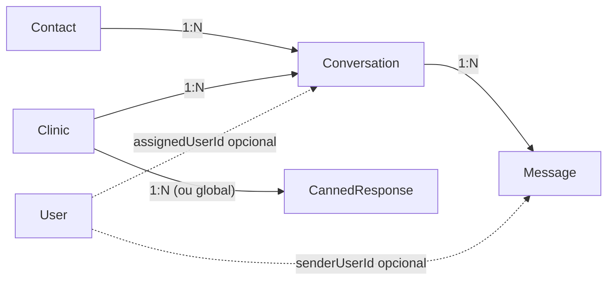
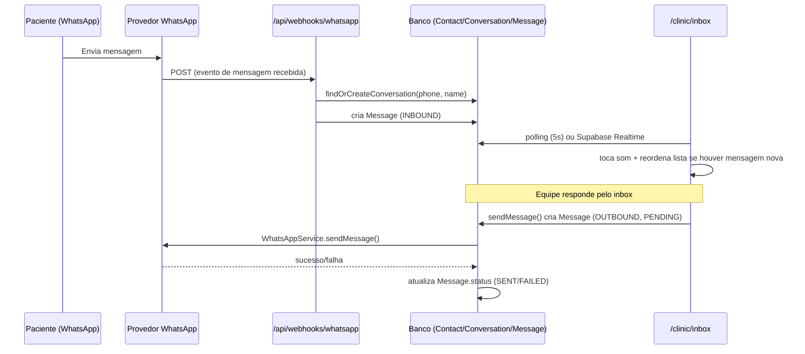
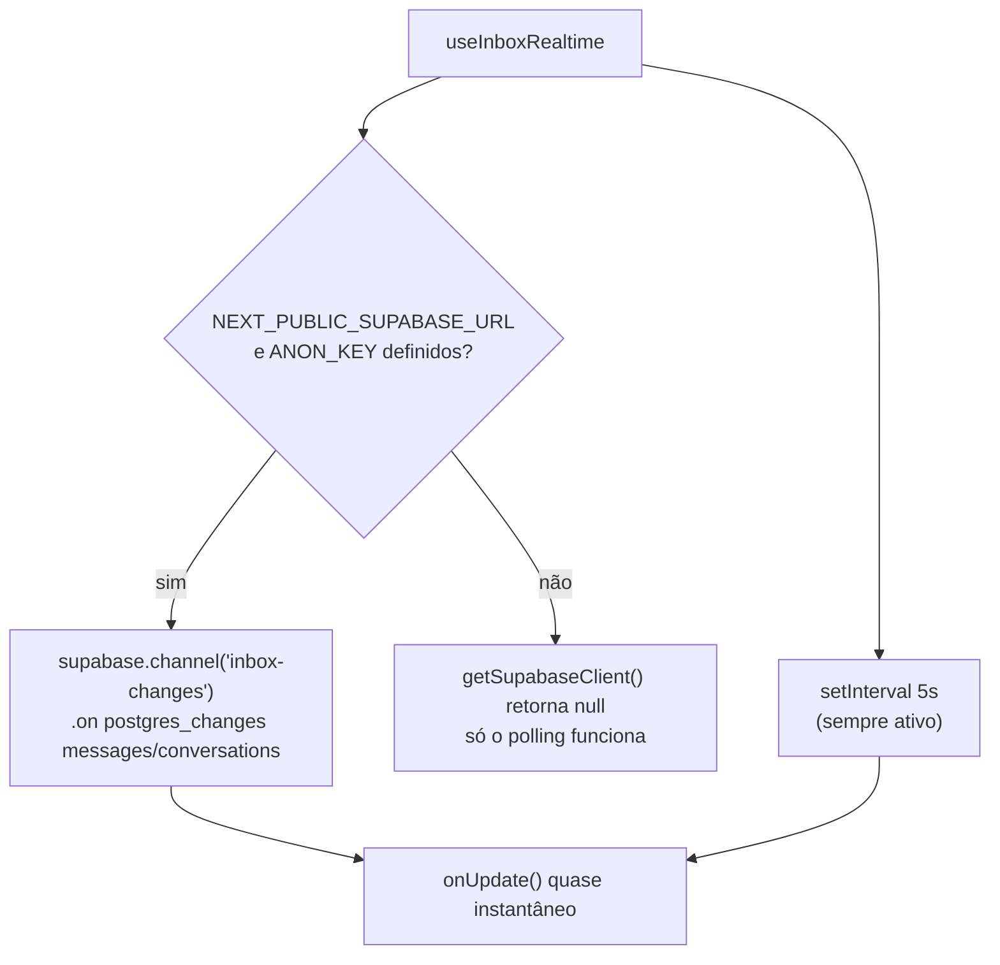

#whatsapp #realtime #crm #arquitetura

> [!info] Sobre esta nota
> Parte de [[00 - Visão Geral]]. Modelos citados aqui estão detalhados em [[02 - Dicionário de Dados e Banco]]. A base de envio/recebimento de WhatsApp (`WhatsAppService`, templates, webhook) está em [[03 - APIs e Webhooks n8n]] — esta nota cobre só a parte de **chat/inbox** construída em cima dela.

## O que é

Uma caixa de entrada estilo Chatwoot/WhatsApp Web dentro do painel da clínica (`/clinic/inbox`), para a equipe conversar com pacientes pelo mesmo número de WhatsApp já usado pelas notificações automáticas — sem precisar abrir o WhatsApp Web separado. Layout de 3 colunas: lista de conversas com filtros, janela de chat, painel de dados do contato.

> [!success] Estado atual
> Funcional de ponta a ponta: mensagens recebidas por WhatsApp entram automaticamente numa conversa, a equipe responde pelo inbox (sai de verdade pelo `WhatsAppService`, mesmo caminho das notificações automáticas), respostas rápidas por atalho (`/jejum` etc.), tags, atribuição/finalização de atendimento, e um atalho para criar agendamento sem sair da conversa. O que é **proposta, não realidade**: sincronização por WebSocket via Supabase Realtime (código pronto, mas sem as credenciais do Supabase Realtime configuradas neste ambiente — funciona hoje só por polling, ver seção própria abaixo) e canais além do WhatsApp (Instagram/Telegram).

## Por que `/clinic/inbox`, não `(dashboard)/inbox`

O `src/middleware.ts` só protege `/admin/:path*` e `/clinic/:path*` (ver [[03 - APIs e Webhooks n8n]]). Um grupo de rotas novo como `(dashboard)/inbox` não muda a URL final, mas também não ganharia proteção nenhuma do middleware sem editá-lo — a caixa de entrada ficaria acessível sem login, expondo conversas com dados de pacientes. Por isso a página vive em `src/app/(clinic)/clinic/inbox/page.tsx`, reaproveitando a proteção e o layout que `/clinic` já tem.

## Modelo de dados

Quatro tabelas novas, adicionadas na migração `20260816022709_add_inbox_module` (ver [[01 - Setup e Infraestrutura]] e [[02 - Dicionário de Dados e Banco]] para o detalhe campo a campo):

- **`Contact`** — pessoa física identificada pelo telefone (`phone` único). Um contato pode ter várias conversas ao longo do tempo (embora hoje, na prática, o webhook sempre reaproveite a mais recente).
- **`Conversation`** — uma "thread" de atendimento, pertence a uma `Clinic` e a um `Contact`, com `status` (`OPEN`/`PENDING`/`RESOLVED`), `tags` (array de texto livre) e `assignedUserId` opcional.
- **`Message`** — cada mensagem da conversa, com `direction` (`INBOUND`/`OUTBOUND`) e `status` (`PENDING`/`SENT`/`DELIVERED`/`READ`/`FAILED`).
- **`CannedResponse`** — respostas rápidas por atalho (`/jejum`, `/pix`...), globais (`clinicId = null`) ou específicas de uma clínica.



## Fluxo de mensagem



### Entrada (`findOrCreateConversation`, em `src/app/api/webhooks/whatsapp/route.ts`)

O webhook de WhatsApp já existia para o fluxo de confirmação de agendamento (`1`/`SIM`, `2`/`CANCELAR` — ver [[03 - APIs e Webhooks n8n]]). Ele foi **estendido**, não substituído: toda mensagem recebida agora também vira uma linha em `messages`, além de continuar rodando a lógica antiga de confirmação por cima.

1. Normaliza o telefone (últimos 11 dígitos) e faz `upsert` em `Contact` (cria se não existir; atualiza o nome se o provedor mandou um).
2. Procura a conversa mais recente desse contato. Se existir, reaproveita — é assim que múltiplas mensagens do mesmo paciente caem na mesma thread.
3. Se **não existir nenhuma conversa** para esse contato, o webhook precisa decidir a qual `Clinic` a conversa pertence. Como os agendamentos individuais têm uma clínica mas o número de WhatsApp da plataforma é **único e global** (variáveis `WHATSAPP_*`, ver [[01 - Setup e Infraestrutura]]), o telefone sozinho não diz de qual clínica é. A heurística usada: pega o agendamento `PENDING`/`CONFIRMED` mais recente com esse telefone e usa a clínica dele (`clinicProcedure.clinicId`).
4. Se nem isso existir (paciente nunca agendou nada), **nenhuma conversa é criada** — a mensagem chega no provedor mas não aparece em nenhum inbox. Limitação conhecida, documentada abaixo.

> [!danger] Limitação conhecida: numero único de WhatsApp para todas as clínicas
> O esquema `WHATSAPP_API_URL`/`WHATSAPP_API_KEY`/`WHATSAPP_INSTANCE_NAME` é global à aplicação, não por clínica — então, tecnicamente, todas as clínicas parceiras "compartilhariam" o mesmo número de WhatsApp se o provedor fosse configurado de verdade hoje. A heurística por agendamento existente é um jeito de já ter uma caixa de entrada funcional sem redesenhar isso, mas o modelo correto para produção multi-clínica seria uma instância de WhatsApp por clínica (mais custo/operação) — não implementado.

### Saída (`sendMessage`, em `src/actions/inbox.ts`)

Server Action chamada pela UI ao enviar uma mensagem:
1. Valida com `sendMessageSchema` (Zod).
2. Cria a `Message` como `OUTBOUND`/`PENDING` imediatamente (para a UI não travar esperando o WhatsApp responder).
3. Chama `whatsappService.sendMessage(contact.phone, content, "chat.outbound")` — o mesmo serviço usado pelas notificações automáticas (retry, backoff, log em `WebhookLog`; ver [[03 - APIs e Webhooks n8n]]).
4. Atualiza `Message.status` para `SENT` ou `FAILED` conforme o resultado, e `Conversation.lastMessageAt`/`status` (reabre se estava `RESOLVED`).

## Sincronização em tempo real: Realtime + polling

Duas camadas, uma sobre a outra:

1. **Polling (funciona hoje, sempre)** — `useInboxRealtime` (`src/hooks/use-inbox-realtime.ts`) roda `setInterval(onUpdate, 5000)` incondicionalmente. É a base funcional real: mesmo sem nenhuma configuração extra, o inbox atualiza sozinho a cada 5 segundos.
2. **Supabase Realtime (pronto, mas não ativo neste ambiente)** — o mesmo hook também tenta abrir um canal `postgres_changes` nas tabelas `messages` e `conversations` via `@supabase/supabase-js`, o que dispensaria o polling e traria a atualização quase instantânea. Ativa só se `NEXT_PUBLIC_SUPABASE_URL`/`NEXT_PUBLIC_SUPABASE_ANON_KEY` estiverem definidas — ver `src/lib/supabase-client.ts`, que retorna `null` (e o hook simplesmente ignora a parte de Realtime) se não estiverem.



> [!danger] `NEXT_PUBLIC_SUPABASE_URL`/`NEXT_PUBLIC_SUPABASE_ANON_KEY` não existem neste ambiente
> O projeto usa o Postgres do Supabase via `DATABASE_URL` (conexão direta, ver [[01 - Setup e Infraestrutura]]), mas isso é diferente de ter o **projeto Supabase** configurado com essas duas chaves públicas para o cliente JS de Realtime. Elas não estavam disponíveis quando este módulo foi construído. O código está pronto para funcionar assim que existirem (`src/lib/supabase-client.ts` cria o client automaticamente se as env vars aparecerem) — não é preciso mudar nada além de definir as variáveis e reiniciar o app.

### Por que RLS com zero políticas (deny-by-default)

O cliente Supabase Realtime do navegador usaria a **anon key**, uma chave pública — qualquer pessoa que inspecionar o bundle JS consegue vê-la. Se ela vazar (o que é esperado, não um incidente), o único motivo de isso não expor conversas de pacientes de todas as clínicas é a migração ter feito:

```sql
ALTER TABLE "conversations" ENABLE ROW LEVEL SECURITY;
ALTER TABLE "messages" ENABLE ROW LEVEL SECURITY;
ALTER TABLE "contacts" ENABLE ROW LEVEL SECURITY;
```

Sem nenhuma `POLICY` criada em cima, RLS ligado = **acesso negado por padrão** para qualquer papel que não seja o dono da tabela. A aplicação não é afetada porque o Prisma conecta como o usuário `postgres` (dono das tabelas), que ignora RLS. Isso significa, na prática, que **o Realtime não vai retornar nenhuma linha para o cliente anon hoje**, mesmo depois de configurar as chaves — é intencional: preferimos "Realtime não funciona" a "Realtime vaza dados de paciente entre clínicas". Se um dia o Realtime for ativado de verdade, o próximo passo é escrever políticas (`USING (clinic_id = current_setting('request.jwt.claims')::json->>'clinic_id')` ou equivalente) antes, não depois.

> [!note] A publicação `supabase_realtime` também é condicional
> A migração adiciona `messages`/`conversations` à publicação `supabase_realtime` só **se ela existir** (`DO $$ ... IF EXISTS (SELECT 1 FROM pg_publication WHERE pubname = 'supabase_realtime') ... $$`). Essa publicação só existe em projetos Supabase de verdade — o banco "shadow" que o Prisma usa para validar migrações não a tem, e a migração precisa rodar limpa nos dois. Não remova essa condicional achando que é código morto.

## Respostas rápidas (`CannedResponse`)

Atalhos digitados no campo de mensagem (`/jejum`, `/pix`, `/confirmacao`, `/atraso` — globais — e `/endereco-<clinica>` — por clínica, todos em `prisma/seed.ts`). `listCannedResponses()` (`src/actions/inbox.ts`) busca `WHERE clinicId = <da sessão> OR clinicId IS NULL`. Na UI, `CannedResponseMenu` (`src/components/inbox/canned-response-menu.tsx`) aparece assim que o texto digitado começa com `/`, filtrando pelo que já foi digitado; escolher um item substitui o conteúdo do campo pelo texto completo da resposta (não apenas insere — a ideia é digitar o atalho e mandar Enter, sem editar o texto padrão).

> [!note] Não existe tela para gerenciar respostas rápidas
> Hoje só é possível adicionar/editar `CannedResponse` via seed ou Prisma Studio — não há formulário em `/clinic`. Mesma situação do catálogo de procedimentos (ver [[04 - Manual de Edição Manual e Manutenção]]).

## Tags e atalho de agendamento

- **Tags** — array de texto livre em `Conversation.tags`, editado em `contact-panel.tsx` (adicionar por Enter num campo, ou um clique nos botões de sugestão `Exame Pendente`/`Retorno`/`Prioritário`/`Confirmado`; remover pelo `x` no badge). Gravado por `updateConversationTags` (`src/actions/inbox.ts`), sem validação de vocabulário — qualquer string vira tag.
- **"Criar Agendamento de Consulta/Exame"** — abre um diálogo (`create-appointment-shortcut.tsx`) pré-preenchido com nome/telefone/CPF do `Contact`, chamando a mesma `createAppointment` (`src/actions/appointments.ts`) usada pelo portal público. O CPF fica editável mesmo pré-preenchido, porque contatos vindos de WhatsApp podem não ter CPF cadastrado (`Contact.cpf` é opcional).

## Trava de Concorrência e Atribuição de Conversas

- **Trava de Concorrência (`claimConversation`)**: Impede que dois atendentes assumam a mesma conversa simultaneamente. Retorna aviso amigável se a conversa já tiver sido assumida por outro atendente.
- **Transferência de Conversa (`transferConversation`)**: Permite encaminhar a conversa para outro membro da equipe ou departamento, inserindo nota interna automática no histórico (`"Conversa transferida para [Nome]"`).

## Limite de Conversas Simultâneas (`maxConcurrentChats`)

- **Capacidade Máxima do Atendente**: Campo `maxConcurrentChats` (padrão 5) no modelo `User`.
- **Validação de Atribuição**: Ao tentar assumir (`claimConversation`) ou transferir (`transferConversation`), a Server Action valida se o atendente já possui `conversasAbertas >= maxConcurrentChats`. Se sim, bloqueia a atribuição com mensagem orientando a finalizar atendimentos abertos.
- **Indicador Visual na Interface**: Pílula de capacidade `⚡ X/Y ativos` exibida no topo do painel e botão `[ 🙋‍♂️ Assumir Atendimento ]` desabilitado quando a capacidade máxima for atingida.

## Modal Obrigatório de Motivo de Resolução (`resolveConversation`)

- **Campos em `Conversation`**: `resolutionReason`, `resolutionNotes`, `resolvedAt`, `resolvedByUserId`.
- **Modal de Finalização**: Ao clicar em "Finalizar Atendimento", exige a seleção de um dos motivos:
  * 🎟️ `AGENDAMENTO_CONCLUIDO`
  * 💡 `DUVIDA_ESCLARECIDA`
  * 💲 `ORCAMENTO_ENVIADO`
  * ⏳ `SEM_RESPOSTA`
  * ❌ `CANCELAMENTO`
  * 🔄 `ENCAMINHADO`
- Insere nota do sistema no chat e libera 1 vaga da pílula de capacidade do atendente.

## Notificações em Tempo Real, Som e Título da Aba

- **Notificações de Desktop (Browser Notification API)**: Dispara pop-up nativo do sistema operacional/navegador ao receber novas mensagens no WhatsApp. O clique no pop-up foca na janela (`window.focus()`) e seleciona a conversa.
- **Contador Dinâmico na Aba**: `updateTabTitleUnreadCount(unreadCount)` altera o título para `(3) Chat / WhatsApp | Conecta Saúde` quando houver mensagens pendentes.
- **Efeito Sonoro Synthesizer**: `playNotificationSound()` executa o bipe sonoro via Web Audio API.

## Chatbot de Triagem IA e Mensagem Fora de Horário

- **Verificação de Expediente (`checkClinicBusinessHours`)**: Valida se a clínica está aberta no momento da mensagem (Horário de Brasília: Seg-Sex 08h-18h, Sáb 08h-12h). Se fechada, responde automaticamente com os horários de atendimento.
- **Triagem Inicial por IA (`processInboundChatbotTriage`)**:
  * Identifica **CPF** (formatados ou numéricos de 11 dígitos) e **Procedimentos/Especialidades** no texto enviado pelo paciente.
  * Grava o CPF no cadastro do paciente (`Contact.cpf`).
  * Atualiza a etapa do funil para `TRIAGEM` e atribui as tags `"⚡ Triado por IA"` e `"🔬 Triagem Concluída"`.
  * Responde ao paciente confirmando os dados coletados e direcionando para a fila de atendimento prioritário da recepção.

## Notas relacionadas

- [[00 - Visão Geral]]
- [[01 - Setup e Infraestrutura]]
- [[02 - Dicionário de Dados e Banco]]
- [[03 - APIs e Webhooks n8n]]
- [[04 - Manual de Edição Manual e Manutenção]]
- [[11 - Modulo Isolado de Atendimento e CRM]] — Kanban de 5 colunas integrado com atalhos de chat e filtros por atendente/departamento

