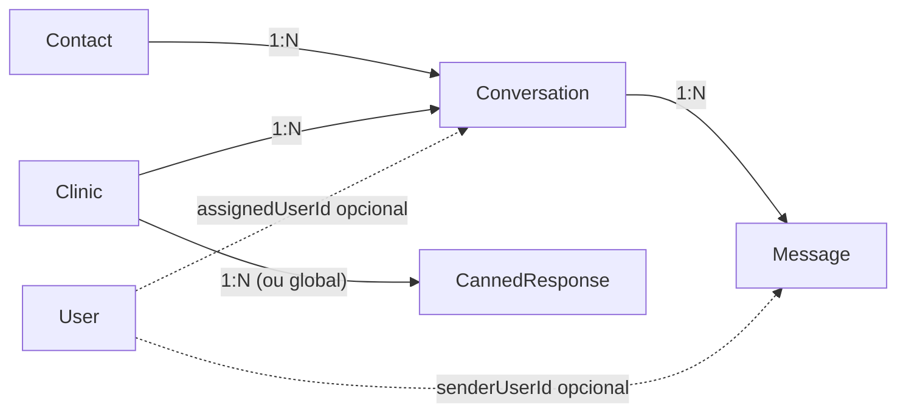
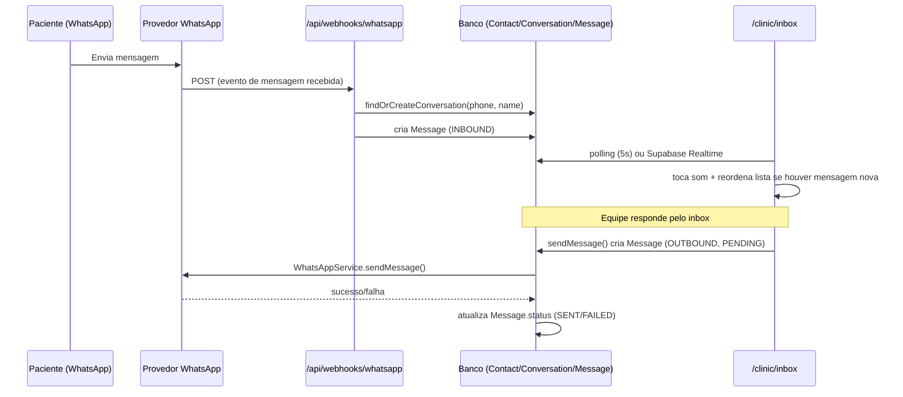
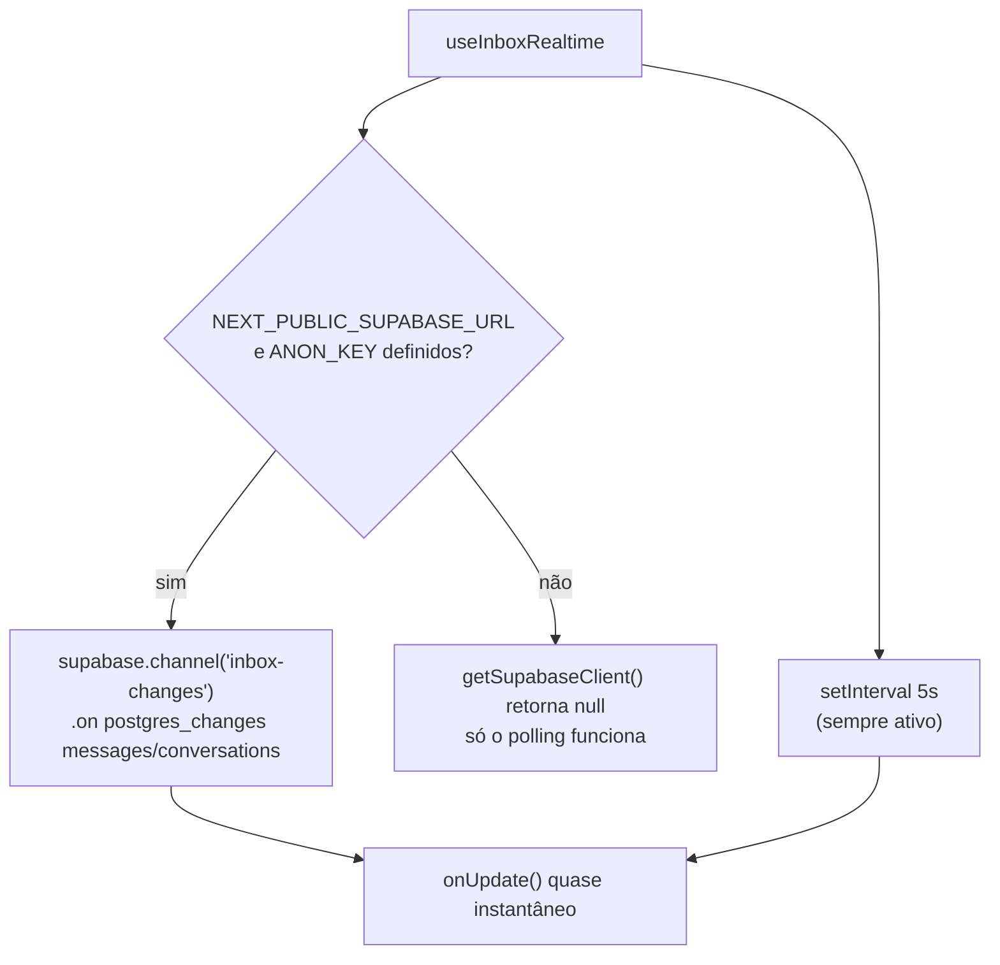

#whatsapp #realtime #crm #arquitetura

> [!info] Sobre esta nota
> Parte de [[00 - Visão Geral]]. Modelos citados aqui estão detalhados em [[02 - Dicionário de Dados e Banco]]. A base de envio/recebimento de WhatsApp (`WhatsAppService`, templates, webhook) está em [[03 - APIs e Webhooks n8n]] — esta nota cobre só a parte de **chat/inbox** construída em cima dela.

## O que é

Uma caixa de entrada estilo Chatwoot/WhatsApp Web dentro do painel da clínica (`/clinic/inbox`), para a equipe conversar com pacientes pelo mesmo número de WhatsApp já usado pelas notificações automáticas — sem precisar abrir o WhatsApp Web separado. Layout de 3 colunas: lista de conversas com filtros, janela de chat, painel de dados do contato.

> [!success] Estado atual
> Funcional de ponta a ponta: mensagens recebidas por WhatsApp entram automaticamente numa conversa, a equipe responde pelo inbox (sai de verdade pelo `WhatsAppService`, mesmo caminho das notificações automáticas), respostas rápidas por atalho (`/jejum` etc.), tags, atribuição/finalização de atendimento, e um atalho para criar agendamento sem sair da conversa. O que é **proposta, não realidade**: sincronização por WebSocket via Supabase Realtime (código pronto, mas sem as credenciais do Supabase Realtime configuradas neste ambiente — funciona hoje só por polling, ver seção própria abaixo) e canais além do WhatsApp (Instagram/Telegram).

## Por que `/clinic/inbox`, não `(dashboard)/inbox`

O `src/middleware.ts` só protege `/admin/:path*` e `/clinic/:path*` (ver [[03 - APIs e Webhooks n8n]]). Um grupo de rotas novo como `(dashboard)/inbox` não muda a URL final, mas também não ganharia proteção nenhuma do middleware sem editá-lo — a caixa de entrada ficaria acessível sem login, expondo conversas com dados de pacientes. Por isso a página vive em `src/app/(clinic)/clinic/inbox/page.tsx`, reaproveitando a proteção e o layout que `/clinic` já tem.

## Modelo de dados

Quatro tabelas novas, adicionadas na migração `20260816022709_add_inbox_module` (ver [[01 - Setup e Infraestrutura]] e [[02 - Dicionário de Dados e Banco]] para o detalhe campo a campo):

- **`Contact`** — pessoa física identificada pelo telefone (`phone` único). Um contato pode ter várias conversas ao longo do tempo (embora hoje, na prática, o webhook sempre reaproveite a mais recente).
- **`Conversation`** — uma "thread" de atendimento, pertence a uma `Clinic` e a um `Contact`, com `status` (`OPEN`/`PENDING`/`RESOLVED`), `tags` (array de texto livre) e `assignedUserId` opcional.
- **`Message`** — cada mensagem da conversa, com `direction` (`INBOUND`/`OUTBOUND`) e `status` (`PENDING`/`SENT`/`DELIVERED`/`READ`/`FAILED`).
- **`CannedResponse`** — respostas rápidas por atalho (`/jejum`, `/pix`...), globais (`clinicId = null`) ou específicas de uma clínica.



## Fluxo de mensagem



### Entrada (`findOrCreateConversation`, em `src/app/api/webhooks/whatsapp/route.ts`)

O webhook de WhatsApp já existia para o fluxo de confirmação de agendamento (`1`/`SIM`, `2`/`CANCELAR` — ver [[03 - APIs e Webhooks n8n]]). Ele foi **estendido**, não substituído: toda mensagem recebida agora também vira uma linha em `messages`, além de continuar rodando a lógica antiga de confirmação por cima.

1. Normaliza o telefone (últimos 11 dígitos) e faz `upsert` em `Contact` (cria se não existir; atualiza o nome se o provedor mandou um).
2. Procura a conversa mais recente desse contato. Se existir, reaproveita — é assim que múltiplas mensagens do mesmo paciente caem na mesma thread.
3. Se **não existir nenhuma conversa** para esse contato, o webhook precisa decidir a qual `Clinic` a conversa pertence. Como os agendamentos individuais têm uma clínica mas o número de WhatsApp da plataforma é **único e global** (variáveis `WHATSAPP_*`, ver [[01 - Setup e Infraestrutura]]), o telefone sozinho não diz de qual clínica é. A heurística usada: pega o agendamento `PENDING`/`CONFIRMED` mais recente com esse telefone e usa a clínica dele (`clinicProcedure.clinicId`).
4. Se nem isso existir (paciente nunca agendou nada), **nenhuma conversa é criada** — a mensagem chega no provedor mas não aparece em nenhum inbox. Limitação conhecida, documentada abaixo.

> [!danger] Limitação conhecida: numero único de WhatsApp para todas as clínicas
> O esquema `WHATSAPP_API_URL`/`WHATSAPP_API_KEY`/`WHATSAPP_INSTANCE_NAME` é global à aplicação, não por clínica — então, tecnicamente, todas as clínicas parceiras "compartilhariam" o mesmo número de WhatsApp se o provedor fosse configurado de verdade hoje. A heurística por agendamento existente é um jeito de já ter uma caixa de entrada funcional sem redesenhar isso, mas o modelo correto para produção multi-clínica seria uma instância de WhatsApp por clínica (mais custo/operação) — não implementado.

### Saída (`sendMessage`, em `src/actions/inbox.ts`)

Server Action chamada pela UI ao enviar uma mensagem:
1. Valida com `sendMessageSchema` (Zod).
2. Cria a `Message` como `OUTBOUND`/`PENDING` imediatamente (para a UI não travar esperando o WhatsApp responder).
3. Chama `whatsappService.sendMessage(contact.phone, content, "chat.outbound")` — o mesmo serviço usado pelas notificações automáticas (retry, backoff, log em `WebhookLog`; ver [[03 - APIs e Webhooks n8n]]).
4. Atualiza `Message.status` para `SENT` ou `FAILED` conforme o resultado, e `Conversation.lastMessageAt`/`status` (reabre se estava `RESOLVED`).

## Sincronização em tempo real: Realtime + polling

Duas camadas, uma sobre a outra:

1. **Polling (funciona hoje, sempre)** — `useInboxRealtime` (`src/hooks/use-inbox-realtime.ts`) roda `setInterval(onUpdate, 5000)` incondicionalmente. É a base funcional real: mesmo sem nenhuma configuração extra, o inbox atualiza sozinho a cada 5 segundos.
2. **Supabase Realtime (pronto, mas não ativo neste ambiente)** — o mesmo hook também tenta abrir um canal `postgres_changes` nas tabelas `messages` e `conversations` via `@supabase/supabase-js`, o que dispensaria o polling e traria a atualização quase instantânea. Ativa só se `NEXT_PUBLIC_SUPABASE_URL`/`NEXT_PUBLIC_SUPABASE_ANON_KEY` estiverem definidas — ver `src/lib/supabase-client.ts`, que retorna `null` (e o hook simplesmente ignora a parte de Realtime) se não estiverem.



> [!danger] `NEXT_PUBLIC_SUPABASE_URL`/`NEXT_PUBLIC_SUPABASE_ANON_KEY` não existem neste ambiente
> O projeto usa o Postgres do Supabase via `DATABASE_URL` (conexão direta, ver [[01 - Setup e Infraestrutura]]), mas isso é diferente de ter o **projeto Supabase** configurado com essas duas chaves públicas para o cliente JS de Realtime. Elas não estavam disponíveis quando este módulo foi construído. O código está pronto para funcionar assim que existirem (`src/lib/supabase-client.ts` cria o client automaticamente se as env vars aparecerem) — não é preciso mudar nada além de definir as variáveis e reiniciar o app.

### Por que RLS com zero políticas (deny-by-default)

O cliente Supabase Realtime do navegador usaria a **anon key**, uma chave pública — qualquer pessoa que inspecionar o bundle JS consegue vê-la. Se ela vazar (o que é esperado, não um incidente), o único motivo de isso não expor conversas de pacientes de todas as clínicas é a migração ter feito:

```sql
ALTER TABLE "conversations" ENABLE ROW LEVEL SECURITY;
ALTER TABLE "messages" ENABLE ROW LEVEL SECURITY;
ALTER TABLE "contacts" ENABLE ROW LEVEL SECURITY;
```

Sem nenhuma `POLICY` criada em cima, RLS ligado = **acesso negado por padrão** para qualquer papel que não seja o dono da tabela. A aplicação não é afetada porque o Prisma conecta como o usuário `postgres` (dono das tabelas), que ignora RLS. Isso significa, na prática, que **o Realtime não vai retornar nenhuma linha para o cliente anon hoje**, mesmo depois de configurar as chaves — é intencional: preferimos "Realtime não funciona" a "Realtime vaza dados de paciente entre clínicas". Se um dia o Realtime for ativado de verdade, o próximo passo é escrever políticas (`USING (clinic_id = current_setting('request.jwt.claims')::json->>'clinic_id')` ou equivalente) antes, não depois.

> [!note] A publicação `supabase_realtime` também é condicional
> A migração adiciona `messages`/`conversations` à publicação `supabase_realtime` só **se ela existir** (`DO $$ ... IF EXISTS (SELECT 1 FROM pg_publication WHERE pubname = 'supabase_realtime') ... $$`). Essa publicação só existe em projetos Supabase de verdade — o banco "shadow" que o Prisma usa para validar migrações não a tem, e a migração precisa rodar limpa nos dois. Não remova essa condicional achando que é código morto.

## Respostas rápidas (`CannedResponse`)

Atalhos digitados no campo de mensagem (`/jejum`, `/pix`, `/confirmacao`, `/atraso` — globais — e `/endereco-<clinica>` — por clínica, todos em `prisma/seed.ts`). `listCannedResponses()` (`src/actions/inbox.ts`) busca `WHERE clinicId = <da sessão> OR clinicId IS NULL`. Na UI, `CannedResponseMenu` (`src/components/inbox/canned-response-menu.tsx`) aparece assim que o texto digitado começa com `/`, filtrando pelo que já foi digitado; escolher um item substitui o conteúdo do campo pelo texto completo da resposta (não apenas insere — a ideia é digitar o atalho e mandar Enter, sem editar o texto padrão).

> [!note] Não existe tela para gerenciar respostas rápidas
> Hoje só é possível adicionar/editar `CannedResponse` via seed ou Prisma Studio — não há formulário em `/clinic`. Mesma situação do catálogo de procedimentos (ver [[04 - Manual de Edição Manual e Manutenção]]).

## Tags e atalho de agendamento

- **Tags** — array de texto livre em `Conversation.tags`, editado em `contact-panel.tsx` (adicionar por Enter num campo, ou um clique nos botões de sugestão `Exame Pendente`/`Retorno`/`Prioritário`/`Confirmado`; remover pelo `x` no badge). Gravado por `updateConversationTags` (`src/actions/inbox.ts`), sem validação de vocabulário — qualquer string vira tag.
- **"Criar Agendamento de Consulta/Exame"** — abre um diálogo (`create-appointment-shortcut.tsx`) pré-preenchido com nome/telefone/CPF do `Contact`, chamando a mesma `createAppointment` (`src/actions/appointments.ts`) usada pelo portal público. O CPF fica editável mesmo pré-preenchido, porque contatos vindos de WhatsApp podem não ter CPF cadastrado (`Contact.cpf` é opcional).

## Atribuição e finalização de atendimento

- **Filtros da coluna 1** (`ConversationFilter` em `src/lib/schemas/inbox.ts`): `mine` (`assignedUserId` = usuário logado), `unassigned` (`assignedUserId = null`), `all` (qualquer conversa com status `OPEN`/`PENDING`, atribuída ou não) e `resolved` (`status = RESOLVED`).
- **"Atribuir a mim"** — `assignConversationToMe`, grava o `id` do usuário da sessão.
- **"Finalizar Atendimento" / "Reabrir"** — `resolveConversation`/`reopenConversation`, alternam `status` entre `RESOLVED` e `OPEN`.

Todas essas Server Actions (em `src/actions/inbox.ts`) conferem que a conversa pertence à `clinicId` da sessão antes de gravar — mesmo padrão de defesa em profundidade descrito em [[03 - APIs e Webhooks n8n]] para as demais Server Actions do painel da clínica.

## Som de notificação

`src/lib/notification-sound.ts` sintetiza um bipe de duas notas (660Hz → 880Hz) via Web Audio API (`AudioContext`/`OscillatorNode`) — não depende de nenhum arquivo de áudio externo. `inbox-app.tsx` compara o total de mensagens não lidas a cada atualização (`totalUnreadRef`) e só toca o som quando esse total **aumenta** (nunca no primeiro carregamento da página, controlado por `isFirstLoadRef`) — assim trocar de aba/filtro não dispara som à toa.

## Layout de 3 colunas e responsividade

`src/components/inbox/inbox-app.tsx` usa uma grid responsiva (`grid-cols-1 md:grid-cols-[300px_1fr] lg:grid-cols-[300px_1fr_300px]`):

| Largura | O que aparece |
|---|---|
| `< 768px` (mobile) | Uma coluna por vez — lista **ou** chat, conforme uma conversa está selecionada ou não. O painel de contato (coluna 3) não aparece |
| `768–1023px` (tablet) | Lista + chat lado a lado, sem painel de contato |
| `≥ 1024px` (desktop) | As 3 colunas |

Para isso funcionar dentro do shell compartilhado do painel da clínica, `src/app/(clinic)/layout.tsx` mudou de `min-h-screen` (rolagem na página inteira) para `h-screen overflow-hidden` no container externo, com `<main className="flex-1 overflow-y-auto p-4">` fazendo a rolagem — as outras páginas de `/clinic` continuam se comportando visualmente igual (cabeçalho/nav fixos), só que agora rolando dentro do `<main>` em vez da janela toda.

## Testado no navegador

Fluxo validado manualmente, logado como uma conta `CLINIC` (ver credenciais atuais em [[01 - Setup e Infraestrutura]]):
- Filtros trocando corretamente entre "Minhas"/"Não Atribuídas"/"Todas"/"Finalizadas", com contagem de não lidas certa.
- Abrir conversa, ver histórico com separador de data, enviar mensagem nova (aparece na hora, some do campo de texto).
- Atalho `/jejum` abrindo o menu de respostas rápidas e substituindo o texto ao escolher.
- Painel de contato (coluna 3, só ≥1024px) mostrando nome/telefone/CPF, tag pré-existente, botões de tag rápida.
- "Criar Agendamento de Consulta/Exame" abrindo o diálogo com o catálogo de procedimentos da clínica carregado (preços formatados certo, sem erro de serialização de `Decimal`), CPF pré-preenchido e editável, e criando o agendamento de fato (confirmado consultando o banco depois).

> [!note] Ferramenta de teste automatizado (`computer` tool) não clica em componentes base-ui
> Durante o teste manual, cliques sintéticos de mouse (via a ferramenta de automação usada para testar) não acionavam `Tabs`/`Dialog` do base-ui (a lib de primitivos por trás do shadcn/ui deste projeto) — só um `.click()`/`dispatchEvent` direto via JavaScript funcionava. Confirmado como limitação da ferramenta de teste, não bug do código: os mesmos elementos respondem normalmente a cliques reais de mouse/touch de um usuário de verdade.

## Como adicionar um canal novo (Instagram, Telegram...)

O desenho já separa "canal de mensagem" de "conversa"/"mensagem" — `Conversation`/`Message` não têm nenhum campo específico de WhatsApp. Para adicionar um canal novo, o caminho seria:

1. Adicionar um campo `channel` (enum: `WHATSAPP`, `INSTAGRAM`, `TELEGRAM`...) em `Conversation` (hoje implícito, sempre WhatsApp — o badge "WhatsApp" na UI é fixo, `src/components/inbox/conversation-list.tsx`).
2. Criar um adapter de envio novo, no mesmo espírito de `buildProviderRequest()` em `src/lib/whatsapp.ts` (ver [[03 - APIs e Webhooks n8n]]) — cada canal tem API de envio própria.
3. Criar um Route Handler de webhook novo (`/api/webhooks/instagram`, por exemplo) que chame uma versão genérica de `findOrCreateConversation` (hoje essa função está dentro de `src/app/api/webhooks/whatsapp/route.ts`, acoplada ao formato de payload do WhatsApp — precisaria ser extraída para `src/lib/inbox-ingestion.ts` ou similar antes de ser reaproveitada por outro canal).
4. `sendMessage` (`src/actions/inbox.ts`) precisaria escolher o adapter certo com base no `channel` da conversa, em vez de sempre chamar `whatsappService`.

Nada disso está implementado — é o desenho de extensão, não uma funcionalidade real hoje.

## Notas relacionadas

- [[00 - Visão Geral]]
- [[01 - Setup e Infraestrutura]]
- [[02 - Dicionário de Dados e Banco]]
- [[03 - APIs e Webhooks n8n]]
- [[04 - Manual de Edição Manual e Manutenção]]
- [[11 - Modulo Isolado de Atendimento e CRM]] — camada visual nova (Open Design) e CRM em Kanban construídos em cima deste modelo de dados
