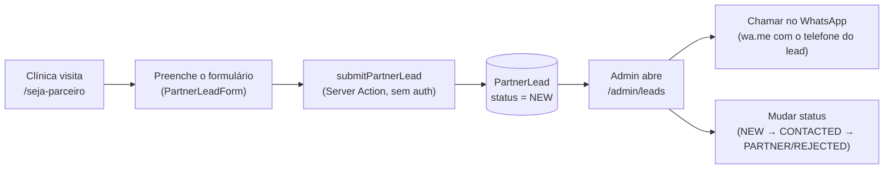

#voucher #qrcode #b2b #arquitetura

> [!info] Sobre esta nota
> Parte de [[00 - Visão Geral]]. Modelo `PartnerLead` detalhado em [[02 - Dicionário de Dados e Banco]]; Server Actions em [[03 - APIs e Webhooks n8n]]. Duas funcionalidades cobertas aqui, sem relação de dependência uma com a outra: a captação de clínicas parceiras (B2B) e a guia de encaminhamento em formato de voucher com QR Code (paciente).

## O que é

1. **Captação B2B ("Seja um Parceiro")** — página pública `/seja-parceiro` com proposta de valor para clínicas/consultórios de Vitória da Conquista, e um formulário de cadastro de interesse. Os envios viram registros de `PartnerLead`, geridos manualmente pelo admin em `/admin/leads`.
2. **Guia Digital / Voucher de Encaminhamento** — depois que o paciente agenda, ele recebe um card estilizado ("guia") com os dados do agendamento e um QR Code. O QR aponta para uma página pública de validação (`/comprovante/[id]`), pensada para a recepção da clínica conferir no celular se o agendamento é autêntico.

> [!success] Estado atual
> Os dois fluxos estão funcionais de ponta a ponta: o formulário grava no banco e aparece no painel admin; a guia é gerada de verdade (QR Code real, apontando para uma URL pública que renderiza os mesmos dados) e pode ser impressa/salva como PDF pelo diálogo de impressão do navegador. O que é **proposta, não realidade**: os dois fluxos não se conectam (virar `PARTNER` num lead não cria a `Clinic`; ver nota em [[02 - Dicionário de Dados e Banco]]), não existe notificação automática (e-mail/WhatsApp) para o admin quando um lead novo chega, e a "validação" do QR Code não tem assinatura criptográfica — é o mesmo modelo de confiança já usado em `/acompanhar/[id]` (cuid longo e não adivinhável como código de acesso informal), não uma prova de autenticidade formal.

## Captação B2B

### Modelo de dados

`PartnerLead` (ver [[02 - Dicionário de Dados e Banco]]) é uma tabela isolada — sem relação com `Clinic`. Campos: `clinicName`, `contactName`, `phone`, `email`, `neighborhood`, `specialties` (texto livre — "quais especialidades/exames a clínica realiza"), `notes` (opcional) e `status` (`NEW`/`CONTACTED`/`PARTNER`/`REJECTED`, default `NEW`).

### Formulário público (`/seja-parceiro`)

`src/app/(public)/seja-parceiro/page.tsx` monta a proposta de valor e os 4 benefícios (ocupação de horários ociosos, sem taxa de adesão, confirmação automática no WhatsApp, painel simples) como conteúdo estático — nenhum desses dados vem do banco. `src/components/public/partner-lead-form.tsx` é o formulário de verdade: Client Component que chama `submitPartnerLead` (`src/actions/partner-leads.ts`) direto, sem `<form action>` — mesmo padrão de `useActionFeedback` (loading + toast) usado nos formulários do admin/clínica (ver [[04 - Manual de Edição Manual e Manutenção]]).

`submitPartnerLead` **não exige sessão** — é chamada de uma página 100% pública, no mesmo espírito de `createAppointment` (guest-checkout, ver [[03 - APIs e Webhooks n8n]]). Validação via `submitPartnerLeadSchema` (Zod, `src/lib/schemas/partner-lead.ts`): telefone precisa ter 10-11 dígitos, e-mail precisa ter formato válido, os demais campos obrigatórios só exigem texto não vazio.

### Painel admin (`/admin/leads`)

Lista todos os `PartnerLead`, mais recentes primeiro (`listPartnerLeads`, exige `requireAdminSession()`). Cada card tem:
- Dados do contato e da clínica, incluindo o texto livre de especialidades/observações.
- Botão **"Chamar no WhatsApp"** — `buildWhatsAppLink(phone, mensagem)` (`src/lib/format.ts`) monta um link `wa.me` com o telefone do lead e uma mensagem inicial pré-preenchida, abrindo em nova aba.
- Botão de e-mail (`mailto:`).
- `PartnerLeadStatusForm` — um `Select` + botão "Salvar" que chama `updatePartnerLeadStatus(id, status)`.

> [!warning] Nada avisa o admin de um lead novo
> Diferente do fluxo de agendamento (que dispara WhatsApp automático), um `PartnerLead` novo só aparece se alguém abrir `/admin/leads` manualmente — não há e-mail, notificação push nem badge de contagem. Se isso for necessário, é uma extensão natural (reaproveitando `WhatsAppService` ou um envio de e-mail transacional), não implementada.

## Guia de Encaminhamento / Voucher com QR Code

### Onde aparece

O mesmo componente (`src/components/public/voucher-card.tsx`, `<VoucherCard />`) é reaproveitado em três lugares:

| Local | Quando | `variant` |
|---|---|---|
| `BookingDialog` (modal de agendamento) | Logo após `createAppointment` ter sucesso | `full` |
| `/acompanhar/[id]` | Sempre que o paciente reabre o link de acompanhamento | `full` |
| `/comprovante/[id]` | Alvo do QR Code — pensado para a recepção da clínica | `validation` |

`variant="full"` mostra o QR Code e os botões de ação (imprimir, WhatsApp). `variant="validation"` troca isso por uma faixa verde "Guia autêntica" no topo e omite o QR (não faz sentido colocar um QR Code apontando para a própria página que já é o destino do QR).

### De onde vêm os dados

`VoucherCard` recebe um `PlainAppointment` (`toPlainAppointment`, `src/lib/serialize.ts`) — a mesma razão de sempre para essa camada de serialização: `Decimal` (preço, comissão) não pode cruzar a fronteira Server→Client como está. Isso obrigou uma mudança em `createAppointment` (`src/actions/appointments.ts`): antes retornava o `Appointment` bruto do Prisma (o que já era arriscado, já que é chamada direto de dois Client Components — `BookingDialog` e o atalho de agendamento do inbox — e simplesmente não quebrava porque nada lia os campos `Decimal` do retorno); agora retorna `toPlainAppointment(appointment)`, então o mesmo valor serve tanto para a UI quanto para montar a guia sem gambiarra.

### Identificador da guia

Não existe um campo `guideCode` no banco — o texto `#VDC-2026-XXXXX` é **calculado na hora de renderizar** (`guideCode()` em `voucher-card.tsx`): `VDC-<ano de criação>-<últimos 5 caracteres do id em maiúsculas>`. É só uma fachada legível por cima do `cuid` real do `Appointment`; a chave de verdade (usada no link do QR e na URL de `/comprovante/[id]`) continua sendo o `id`.

### CPF mascarado

`maskCpf()` (`src/lib/format.ts`) mostra só os 3 primeiros e os 2 últimos dígitos: `123.***.**8-00`. É mascaramento de exibição — o CPF completo continua no banco (`Appointment.patientCpf`) e trafega normal nas outras telas (painel da clínica, WhatsApp). A guia é o único lugar que mascara, porque é o único documento pensado para ser impresso/mostrado a terceiros.

### QR Code e o modelo de confiança

`QRCodeSVG` (pacote `qrcode.react`) renderiza um QR Code vetorial apontando para `${getBaseUrl()}/comprovante/{id}` (`getBaseUrl()` lê `NEXTAUTH_URL`, com fallback pro `localhost:3000` — mesma lógica já usada nos links de acompanhamento das mensagens de WhatsApp, ver [[03 - APIs e Webhooks n8n]]). `/comprovante/[id]` é uma rota **pública, sem autenticação** — chama o mesmo `getAppointmentById` de `/acompanhar/[id]`.

> [!danger] Não é uma assinatura criptográfica
> "Autêntica" na faixa verde de `/comprovante/[id]` significa apenas "esse `id` existe no banco e os dados batem com o que está gravado" — não existe um hash, assinatura ou token de validação separado do próprio `id`. Isso é aceitável no mesmo nível de risco já documentado para `/acompanhar/[id]` (o `id` é um `cuid` longo, não sequencial, não adivinhável por tentativa e erro) — ver [[00 - Visão Geral]]. Não é o desenho certo se o requisito for "prova formal contra fraude"; nesse caso precisaria de um token HMAC separado do `id`, não implementado.

### Impressão ("Imprimir / Salvar PDF")

Sem biblioteca de geração de PDF — o botão só chama `window.print()`, e o usuário escolhe "Salvar como PDF" no diálogo nativo do navegador/SO. A "impressão limpa" vem de classes `print:` do Tailwind (variante nativa do framework, não precisou de CSS separado nem de plugin):
- `print:hidden` no `<header>` e no `<SiteFooter />` do layout público (`src/app/(public)/layout.tsx`, `site-footer.tsx`) — a navegação some ao imprimir, em qualquer página pública, não só na guia.
- `print:hidden` nos botões de ação dentro do próprio `VoucherCard` — não faz sentido imprimir um botão "Imprimir".
- `print:border-black print:shadow-none` no card — troca a borda pontilhada azul (decorativa, pouco visível em impressora P&B) por uma borda sólida preta ao imprimir.

### "Enviar Guia no WhatsApp"

Monta um link `https://wa.me/?text=<mensagem>` **sem número de telefone** — isso abre o WhatsApp do próprio paciente pedindo para ele escolher um contato (ele mesmo em outro aparelho, um familiar, etc.), em vez de assumir um destinatário fixo. A mensagem inclui o código da guia, procedimento, clínica, data/horário e o link de `/comprovante/[id]`.

## Como testar

1. **Lead B2B**: abra `/seja-parceiro`, preencha o formulário e envie — toast de sucesso confirma. Logue como admin (`admin@tivdc.com.br`, ver [[01 - Setup e Infraestrutura#Acessos (credenciais de desenvolvimento)]]) e abra `/admin/leads`: o card deve aparecer com status "Novo". Teste "Chamar no WhatsApp" (abre `web.whatsapp.com`/app com o número do lead) e a troca de status.
2. **Guia com QR Code**: agende um procedimento pelo portal público (`/buscar` → escolher um procedimento → "Solicitar Agendamento"). Depois de confirmar, a guia aparece dentro do próprio modal. Abra `/acompanhar/{id}` (o `id` retornado) para ver a mesma guia numa página cheia. Escaneie o QR Code (ou copie o link) para abrir `/comprovante/{id}` — deve mostrar a faixa "Guia autêntica" e os mesmos dados, sem QR nem botões de ação.
3. **Impressão**: na guia (variant `full`), clique "Imprimir / Salvar PDF" — confira no preview de impressão que o cabeçalho/rodapé do site somem e só a guia aparece.

## Notas relacionadas

- [[00 - Visão Geral]]
- [[01 - Setup e Infraestrutura]]
- [[02 - Dicionário de Dados e Banco]]
- [[03 - APIs e Webhooks n8n]]
- [[04 - Manual de Edição Manual e Manutenção]]
