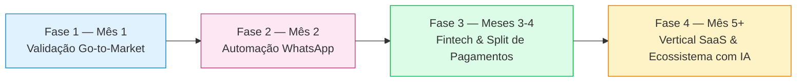

#roadmap #estrategia #planejamento #saas

> [!info] Sobre esta nota
> Parte de [[00 - Visão Geral]]. Roadmap estratégico da Conecta Saúde — o que já existe hoje no código está descrito em [[00 - Visão Geral]], [[07 - Guia de Encaminhamento e Captação B2B]] e [[08 - Playbook Comercial e Proposta B2B]]; esta nota é **planejamento, não implementação**: registra a sequência de fases, o racional de negócio por trás de cada uma e os KPIs que definem se a fase seguinte deve começar. Nenhum item aqui está codificado — é o mapa do que vem depois do estado atual do produto.

## Visão geral das fases

Cada fase só deve começar depois que os KPIs de validação da fase anterior forem atingidos (ver [[#KPIs e Métricas de Validação por Fase]]) — o roadmap é sequencial por desenho, não paralelo: não faz sentido investir em automação de WhatsApp (Fase 2) antes de provar que existe demanda real com clínicas de verdade (Fase 1), nem em split de pagamento (Fase 3) antes do volume de agendamentos justificar a integração com um gateway financeiro.

## Fase 1 (Mês 1) — Validação Go-to-Market

**Objetivo:** provar que o modelo (captação de clínicas + agendamento particular + comissão só no sucesso) funciona de verdade com clínicas reais de Vitória da Conquista, antes de investir em automação ou infraestrutura adicional.

- **Ativação das primeiras 3-5 clínicas parceiras** — usando o playbook comercial já pronto (scripts de abordagem quente/fria, matriz de objeções e termo de adesão, ver [[08 - Playbook Comercial e Proposta B2B]]) e a proposta comercial em `/proposta-comercial`. Priorizar clínicas com boa ocupação ociosa e especialidades de alta procura (clínico geral, cardiologia, exames de imagem).
- **Compra e ativação de um chip de WhatsApp dedicado** — número comercial próprio da Conecta Saúde para o envio das notificações automáticas (hoje o `WhatsAppService` já sabe enviar via Evolution API/UAZAPI/Z-API, ver [[03 - APIs e Webhooks n8n]]; falta o número/instância de produção, que hoje roda em modo `SKIPPED` sem provedor configurado).
- **Primeiras guias com QR Code emitidas de verdade** — validar em campo o fluxo de guia de encaminhamento (`VoucherCard`, ver [[07 - Guia de Encaminhamento e Captação B2B]]) sendo de fato impressa/mostrada na recepção das clínicas piloto, não só testada em ambiente de desenvolvimento.
- **Acompanhamento manual e próximo das clínicas piloto** — nessa fase o volume é baixo o suficiente para o time comercial acompanhar cada agendamento de perto e coletar feedback qualitativo, em vez de depender de automação.

## Fase 2 (Mês 2) — Automação Total no WhatsApp

**Objetivo:** eliminar trabalho manual de notificação e reduzir a taxa de no-show, que é o maior risco financeiro do modelo de comissão só-no-sucesso (agendamento que não se confirma não gera receita).

- **Automação completa via Evolution API / UAZAPI** — sair do modo `SKIPPED`/desenvolvimento para uma instância de produção real, com o `WhatsAppService` (adapters já implementados, ver [[03 - APIs e Webhooks n8n]]) enviando de fato, não só logando.
- **Lembretes D-1 e D-0** — nova rotina de notificação (hoje só existe notificação disparada por mudança de status — `PENDING`, `CONFIRMED`, etc.) que dispara um lembrete automático 1 dia antes e no próprio dia do agendamento, para reduzir no-show sem depender da equipe da clínica lembrar o paciente manualmente.
- **Fila de Espera Inteligente (Standby List)** — quando um horário é cancelado, o sistema notifica automaticamente pacientes que ficaram numa lista de espera para aquele procedimento/clínica/período, oferecendo o horário liberado por ordem de chegada na fila — hoje não existe: um cancelamento simplesmente libera o horário sem avisar ninguém.

## Fase 3 (Meses 3-4) — Módulo Fintech & Split Automático de Pagamentos

**Objetivo:** resolver o maior atrito operacional do modelo atual — hoje o paciente paga direto no balcão da clínica e a Conecta Saúde cobra a comissão manualmente, uma vez por mês (ver termo de compromisso em [[08 - Playbook Comercial e Proposta B2B]]). Automatizar isso remove trabalho de cobrança manual e reduz risco de inadimplência da comissão.

- **Integração com gateway de pagamento com split nativo** — avaliar Asaas ou Efí (ambos com suporte a split de pagamento via API, sem precisar construir a lógica de divisão financeira do zero).
- **Split automático e instantâneo** — divisão do valor do procedimento no momento do pagamento: **85% para a clínica/médico, 15% para a Conecta Saúde** (percentual de referência a validar contra a faixa de 10-15% já praticada na tabela de comissionamento sugerida — ver [[08 - Playbook Comercial e Proposta B2B]]; pode variar por clínica/procedimento, assim como a comissão hoje).
- **Pagamento pelo paciente dentro da própria plataforma** (cartão/Pix), como alternativa ao pagamento no balcão — mantendo o balcão como opção, não substituindo.
- **Fim do fechamento manual mensal de comissão** — o relatório financeiro do admin (`/admin/relatorio`, ver [[02 - Dicionário de Dados e Banco]]) passa a refletir repasses já processados automaticamente, não uma cobrança a ser feita manualmente depois.

## Fase 4 (Mês 5+) — Vertical SaaS & Ecossistema Clínico com IA

**Objetivo:** evoluir de "plataforma de agendamento" para uma suíte de ferramentas que a clínica usa no dia a dia (não só para captar pacientes particulares), criando dependência de produto e uma segunda linha de receita recorrente (SaaS) além da comissão por agendamento.

- **Prontuário com transcrição de voz via Gemini Flash** — a equipe da clínica grava a consulta (ou dita um resumo) e a IA transcreve e estrutura o registro no prontuário do paciente, reduzindo o tempo gasto digitando anotações manualmente.
- **Relatórios de faturamento** — visão consolidada de receita por procedimento/período para a própria clínica (diferente do relatório financeiro do admin da Conecta Saúde, que é sobre comissão — este é sobre a operação inteira da clínica, incluindo pacientes que não vieram pela plataforma).
- **Expansão regional** — levar o modelo já validado em Vitória da Conquista para cidades próximas: **Barra do Choça, Planalto, Poções, Jequié e Itapetinga**, repetindo o playbook comercial (Fase 1) em cada nova praça, já com a automação de WhatsApp (Fase 2) e o split de pagamento (Fase 3) prontos desde o primeiro dia — diferente de Vitória da Conquista, que teve que validar cada fase em sequência.

> [!note] Por que IA e expansão regional vêm por último
> Prontuário com IA e expansão para novas cidades são os itens de maior investimento e menor reversibilidade do roadmap — só fazem sentido depois que o modelo básico (Fases 1-3) já provou reter clínicas parceiras e gerar receita recorrente suficiente para sustentar o custo de um módulo de IA e de operação multi-cidade.

## KPIs e Métricas de Validação por Fase

| Fase | KPI | Meta de validação |
|---|---|---|
| **1 — Go-to-Market** | Clínicas parceiras ativas | 3-5 clínicas com pelo menos 1 agendamento realizado |
| | Agendamentos solicitados/realizados | Acompanhamento semanal via `/admin/relatorio` |
| | Taxa de conversão busca → agendamento | Baseline a ser estabelecido (sem dado histórico ainda) |
| | Tempo médio de confirmação pela clínica | < 24h da solicitação à confirmação |
| | Feedback qualitativo das clínicas piloto | Coletado manualmente pelo time comercial a cada 2 semanas |
| **2 — Automação WhatsApp** | Taxa de no-show | Redução mensurável frente à baseline da Fase 1 |
| | Entrega de lembretes D-1/D-0 | > 95% de entrega confirmada pelo provedor |
| | Horários preenchidos pela Fila de Espera | > 0 (validação de que a funcionalidade gera valor real, não só existe) |
| | Tempo de resposta do webhook de entrada | Sem regressão frente ao SLA atual (ver [[03 - APIs e Webhooks n8n]]) |
| **3 — Fintech & Split** | % de pagamentos via split automático | Meta de adoção a definir com as clínicas piloto do split |
| | Tempo médio de repasse à clínica | Repasse em D+1 ou menor (vs. fechamento mensal manual atual) |
| | Taxa de erro/falha no split | < 1% das transações |
| | GMV processado pela plataforma | Métrica de acompanhamento contínuo, sem meta fixa nesta fase |
| **4 — Vertical SaaS & IA** | Clínicas usando o prontuário com IA | Adoção voluntária por pelo menos as clínicas mais maduras na plataforma |
| | Precisão percebida da transcrição de voz | Validação qualitativa com as clínicas piloto do módulo |
| | Novas cidades ativas | Pelo menos 1 das 5 cidades-alvo com clínica parceira ativa |
| | Receita recorrente (MRR) do módulo SaaS | Nova linha de receita, acompanhada separadamente da comissão por agendamento |

## Notas relacionadas

- [[00 - Visão Geral]]
- [[03 - APIs e Webhooks n8n]] — `WhatsAppService`, adapters de provedor e o relatório financeiro do admin
- [[07 - Guia de Encaminhamento e Captação B2B]] — guia com QR Code (Fase 1) e captação de clínicas
- [[08 - Playbook Comercial e Proposta B2B]] — scripts, tabela de comissionamento e termo de adesão usados na ativação de clínicas (Fase 1) e como referência de percentual para o split automático (Fase 3)
