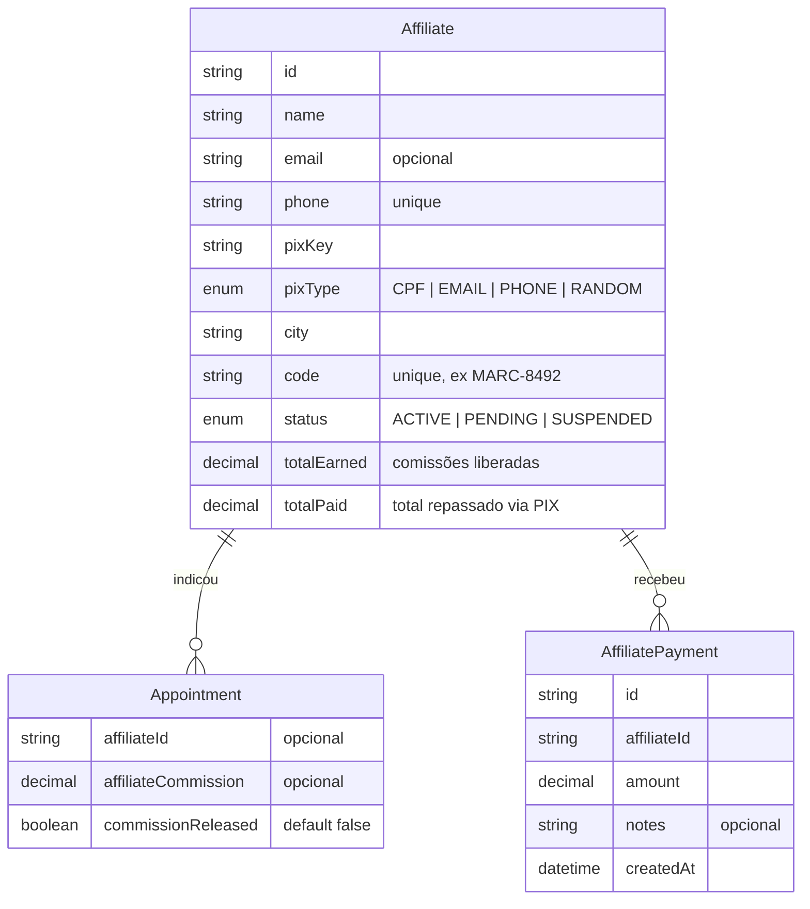
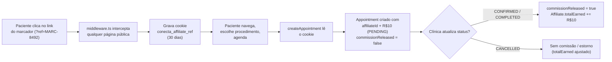

#afiliados #tracking #comissao #arquitetura

> [!info] Sobre esta nota
> Parte de [[00 - Visão Geral]]. Modelo `Affiliate` e campos novos em `Appointment` e `AffiliatePayment` detalhados em [[02 - Dicionário de Dados e Banco]]; Server Actions em [[03 - APIs e Webhooks n8n]].

## O que é

Programa de indicação para "marcadores" (marcadores de consulta, líderes comunitários, farmácias, agentes de saúde etc.): a pessoa se cadastra em `/afiliados`, recebe um link/QR Code próprio (`?ref=CODIGO`) e ganha uma comissão fixa a cada agendamento **confirmado ou concluído** através desse link.

> [!success] Estado atual
> Módulo completo e finalizado de ponta a ponta com regras financeiras seguras e controle de repasse PIX:
> 1. **Cadastro público** em `/afiliados` com chave PIX e WhatsApp.
> 2. **Tracking automático via cookie de 30 dias** (`?ref=CODIGO` interceptado pelo `middleware.ts`).
> 3. **Liberação segura de comissão**: a comissão (R$ 10,00) é atribuída ao agendamento, mas a liberação financeira para o marcador (`commissionReleased = true` e incremento de `totalEarned`) só ocorre quando a clínica altera o status do atendimento para `CONFIRMED` ou `COMPLETED`. Se o agendamento for cancelado (`CANCELLED`), a comissão não é liberada (ou é estornada caso tivesse sido pré-liberada).
> 4. **Painel de Gestão Admin (`/admin/afiliados`)**:
>    - Botões de aprovação de cadastro (`PENDING` -> `ACTIVE`), suspensão e reativação.
>    - Botão "💬 WhatsApp" para contato direto via WhatsApp Web.
>    - Botão "📋 Copiar Chave PIX" com notificação toast.
>    - Botão "💸 Registrar Pagamento PIX" com modal para confirmar o repasse efetuado, registrando o histórico em `AffiliatePayment` e abatendo do saldo do marcador (`totalPaid`).
> 5. **Painel do Marcador (`/afiliados/painel`)**:
>    - Métricas separadas: **Saldo Liberado para Saque (PIX)**, **Comissões Pendentes** e **Total Já Recebido**.
>    - Histórico de indicações com nomes mascarados (LGPD) e status detalhado da comissão (*Liberada*, *Pendente*, *Cancelada*).

## Modelo de dados

`Affiliate.code` é gerado no cadastro (`MARC-` + 4 dígitos aleatórios, `generateUniqueAffiliateCode` em `src/actions/affiliates.ts`) com checagem de unicidade no banco antes de gravar — não é um campo editável pelo marcador. Novo cadastro nasce com `status = PENDING`.

`Appointment.affiliateId`/`affiliateCommission` são opcionais: agendamentos normais ficam `null`.

`AffiliatePayment` armazena o histórico de repasses PIX efetuados pelo admin, permitindo auditoria financeira completa.

## Tracking e Liberação de Comissão

### Captura no middleware

`src/middleware.ts` intercepta `?ref=CODIGO` em qualquer página pública e grava o cookie `conecta_affiliate_ref` com `maxAge` de 30 dias (`AFFILIATE_REF_COOKIE_MAX_AGE`, `src/lib/affiliate.ts`).

### Atribuição em `createAppointment` e Liberação em `updateAppointmentStatus`

1. Em `src/actions/appointments.ts`, o agendamento é criado com `affiliateId` e `affiliateCommission = 10` e `commissionReleased = false`.
2. Em `src/actions/clinic.ts` (`updateAppointmentStatus`), quando a clínica altera o agendamento para `CONFIRMED` ou `COMPLETED`, o sistema define `commissionReleased = true` e incrementa o `Affiliate.totalEarned`.

## Painel do Marcador (`/afiliados/painel`)

- **Saldo Liberado para Saque (PIX)** = `totalEarned - totalPaid`
- **Comissões Pendentes** = soma das comissões de consultas ainda em `PENDING`.
- **Total Já Recebido (PIX)** = `totalPaid`
- **Histórico Mascarado**: Exibe os atendimentos indicados mantendo a privacidade do paciente (`"Maria S**** S****"`) e indicando o status da comissão (*Liberada (PIX)*, *Pendente*, *Cancelada*).

## Painel Admin (`/admin/afiliados`)

- **Tabela e Ações**:
  - Aprovação de cadastro (`PENDING` -> `ACTIVE`).
  - Botão WhatsApp direto para contato rápido (`wa.me/55...`).
  - Cópia da chave PIX em um clique.
  - Registro de repasse PIX via modal interativo.

## Notas relacionadas

- [[00 - Visão Geral]]
- [[02 - Dicionário de Dados e Banco]]
- [[03 - APIs e Webhooks n8n]]
- [[07 - Guia de Encaminhamento e Captação B2B]]
