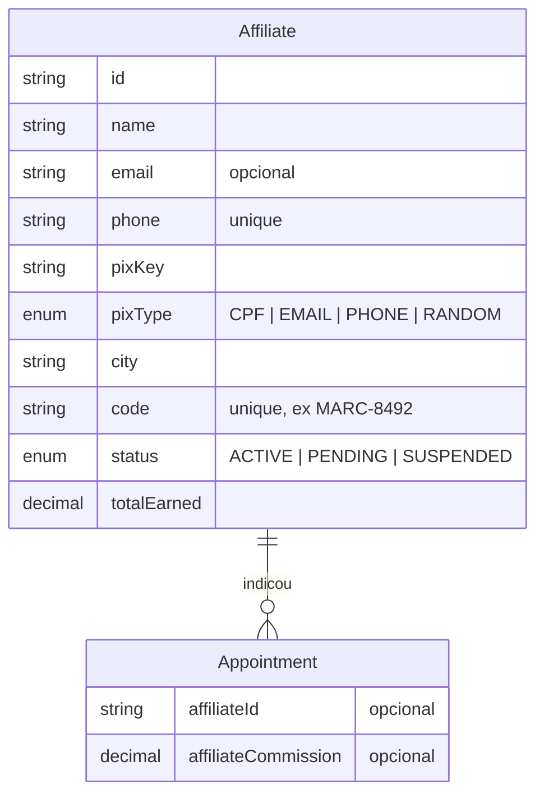
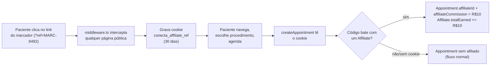

#afiliados #tracking #comissao #arquitetura

> [!info] Sobre esta nota
> Parte de [[00 - Visão Geral]]. Modelo `Affiliate` e campos novos em `Appointment` detalhados em [[02 - Dicionário de Dados e Banco]]; Server Actions em [[03 - APIs e Webhooks n8n]].

## O que é

Programa de indicação para "marcadores" (marcadores de consulta, líderes comunitários, farmácias, agentes de saúde etc.): a pessoa se cadastra em `/afiliados`, recebe um link/QR Code próprio (`?ref=CODIGO`) e ganha uma comissão fixa a cada agendamento criado através desse link.

> [!success] Estado atual
> Cadastro público, tracking via cookie, atribuição automática da comissão em `createAppointment`, painel do marcador (métricas + histórico) e painel de gestão do admin (lista + chave PIX) estão todos funcionais de ponta a ponta. O que é **proposta, não realidade**: não existe fluxo de pagamento/PIX automatizado (o admin faz o acerto financeiro manualmente, fora do sistema, usando a chave PIX listada em `/admin/afiliados`) nem um mecanismo de "marcar como pago" que zere `totalEarned` — o campo é um total acumulado desde o cadastro, não um saldo líquido de comissões pendentes.

## Modelo de dados

`Affiliate.code` é gerado no cadastro (`MARC-` + 4 dígitos aleatórios, `generateUniqueAffiliateCode` em `src/actions/affiliates.ts`) com checagem de unicidade no banco antes de gravar — não é um campo editável pelo marcador. Novo cadastro nasce com `status = PENDING`; a ativação para `ACTIVE` é manual, feita hoje só via banco/Prisma Studio (não existe uma tela admin de aprovação — ver seção de limitações abaixo).

`Appointment.affiliateId`/`affiliateCommission` são opcionais: a grande maioria dos agendamentos não passa por um marcador, então ficam `null`.

## Tracking (`?ref=CODIGO` → cookie → agendamento)

### Captura no middleware

`src/middleware.ts` já existia para proteger `/admin` e `/clinic` via `withAuth`. Para capturar `?ref=` em **qualquer** página pública (não só nas protegidas), o `matcher` foi ampliado para praticamente todas as rotas (exceto `api`, `_next/static`, `_next/image`, `favicon.ico`, `icon.svg`), e o callback `authorized` passou a só exigir sessão para `pathname` começando com `/admin` ou `/clinic` — nas demais, retorna `true` incondicionalmente, deixando a função `middleware()` rodar (sem isso, `withAuth` redirecionaria qualquer visitante anônimo para `/entrar` antes mesmo do tracking rodar).

Dentro da função `middleware()`, depois da checagem de role, `searchParams.get("ref")` grava (se presente) o cookie `conecta_affiliate_ref` com `maxAge` de 30 dias (`AFFILIATE_REF_COOKIE_MAX_AGE`, `src/lib/affiliate.ts`) — o valor do cookie é o `code` do afiliado, sem validação nesse ponto (a validação de "esse código existe mesmo?" só acontece depois, em `createAppointment`, para não acoplar o middleware ao banco).

### Atribuição em `createAppointment`

`src/actions/appointments.ts` lê o cookie via `getAffiliateRefCode()`, busca o `Affiliate` pelo `code` (case-insensitive — normaliza para maiúsculas) e, se encontrar, grava `affiliateId`/`affiliateCommission` no `Appointment` e incrementa `Affiliate.totalEarned` num segundo `update` logo depois do `create`.

> [!warning] `getAffiliateRefCode()` engole erro de propósito
> `cookies()` (de `next/headers`) só funciona dentro do ciclo de request do Next — Server Action chamada via form/fetch do client, ou render de página. O teste de integração (`appointments.test.ts`) chama `createAppointment` **direto**, fora desse contexto, e isso derruba `cookies()` com "outside a request scope". `getAffiliateRefCode()` captura esse erro e retorna `null` (sem afiliado) em vez de propagar — é o motivo do try/catch, não um descuido.

### Comissão: valor fixo, não percentual

`AFFILIATE_COMMISSION_FLAT = 10` (`src/lib/affiliate.ts`) — R$10,00 fixos por agendamento atribuído, independente do valor do procedimento. A comissão é creditada na criação do agendamento (status `PENDING`), não só quando ele é confirmado/concluído — ou seja, `totalEarned` reflete indicações registradas, não necessariamente atendimentos que de fato aconteceram. Trocar para percentual (ex: 5% do valor do procedimento) é uma mudança pontual nesse mesmo trecho, não uma mudança de schema.

### Por que não um campo `affiliateCode` digitável no formulário de agendamento

O enunciado deste módulo previa "cookie **ou** código digitado". `BookingDialog` (o modal de agendamento) não ganhou um campo novo para digitar o código manualmente — é um componente compartilhado por todo o fluxo público, e a fonte de verdade adotada foi só o cookie (que já cobre o caso de uso principal: o marcador compartilha o link, o paciente clica, agenda, comissão é atribuída). Se um canal sem `?ref=` (ex: indicação verbal) precisar de atribuição manual, adicionar um campo opcional ao `createAppointmentSchema` e um input no `BookingDialog` é a extensão natural — não implementado para não crescer escopo num componente sensível sem necessidade concreta ainda.

## Cadastro público (`/afiliados`)

`src/app/(public)/afiliados/page.tsx` — proposta de valor ("Ganhe renda extra indicando pacientes...") + explicação em 3 passos (receba o link → indique → receba a comissão) + lista de públicos-alvo (marcadores, líderes comunitários, farmácias, agentes de saúde etc.) + formulário.

`src/components/public/affiliate-signup-form.tsx` — Client Component, mesmo padrão de `PartnerLeadForm` (`useActionFeedback` para loading/toast, sem `<form action>`). Campos: nome, WhatsApp, cidade, tipo de chave PIX (`Select` controlado) e a chave em si. Chama `registerAffiliate` (`src/actions/affiliates.ts`), que **não exige sessão** — mesmo espírito guest-checkout de `submitPartnerLead`/`createAppointment`.

## Painel do Marcador (`/afiliados/painel`)

### "Login simples via WhatsApp/código"

Não é NextAuth — `Affiliate` não é um `User`. `loginAffiliateAction` recebe telefone + código, busca um `Affiliate` com esse par exato (`findFirst({ where: { phone, code } })`) e, se encontrar, grava o `id` do afiliado num cookie `httpOnly` (`conecta_affiliate_session`, 90 dias). `getAffiliateSession()` lê esse cookie em cada acesso à página do painel. Não há senha, hash ou rate-limit — é deliberadamente leve, adequado ao risco baixo (o painel só expõe as próprias métricas e um histórico com nomes mascarados, nunca dado sensível de outro marcador ou paciente completo).

`src/app/(public)/afiliados/painel/page.tsx` é um Server Component: sem sessão, renderiza `<AffiliateLoginForm />`; com sessão, busca `getAffiliateDashboard(affiliateId)` e renderiza o painel completo. `AffiliateLoginForm`/`AffiliateLogoutButton` chamam `router.refresh()` depois da Server Action (login/logout) para o Server Component re-renderizar já lendo o cookie novo — sem isso, a página ficaria presa na versão renderizada antes do cookie existir.

### Link, QR Code e histórico mascarado

O link de divulgação é montado como `${getBaseUrl()}/?ref=${affiliate.code}` (aponta pra home, não pra uma página específica — o paciente cai na busca normal já rastreado). `AffiliateCopyLinkButton` copia pro clipboard uma mensagem pronta pra colar no WhatsApp (não é um link cru — já vem com um texto de convite), com fallback de erro se `navigator.clipboard` falhar (ex: contexto não-HTTPS).

`getAffiliateDashboard()` calcula:
- **Indicações no Mês** — `Appointment.createdAt >= primeiro dia do mês corrente (UTC)`.
- **Atendimentos Confirmados** — status `CONFIRMED` ou `COMPLETED`.
- **Comissão a Receber** — `Affiliate.totalEarned` direto (não há distinção entre "ganho" e "já pago"; ver limitação acima).
- **Histórico** — últimos 20 agendamentos, com `patientName` passado por `maskPatientName()` (`src/lib/affiliate.ts`): mantém o primeiro nome completo e abrevia os demais para a inicial + asteriscos (`"Maria Silva Souza"` → `"Maria S**** S****"`). Mascaramento de exibição, igual ao `maskCpf()` do voucher (ver [[07 - Guia de Encaminhamento e Captação B2B]]) — o nome completo continua no banco.

## Painel de gestão do Admin (`/admin/afiliados`)

`getAffiliates()` (exige `requireAdminSession()`) lista todos os marcadores ordenados por `totalEarned` desc. A tabela mostra nome, código, cidade, WhatsApp, **chave PIX + tipo** (pra permitir o acerto financeiro manual) e o total gerado, com uma linha de soma no rodapé — mesmo padrão de `getFinancialReport()`/`/admin/relatorio` (ver [[03 - APIs e Webhooks n8n]]). Link adicionado em `admin-nav.tsx`: "👥 Marcadores / Afiliados".

> [!warning] Sem tela de aprovação de cadastro
> Novo marcador nasce `PENDING`. Não existe (ainda) um botão em `/admin/afiliados` para promover pra `ACTIVE` ou suspender — precisa editar direto no banco (Prisma Studio ou SQL). É a mesma lacuna que `PartnerLead` tinha antes de ganhar `ApproveClinicDialog` (ver [[07 - Guia de Encaminhamento e Captação B2B]]); um botão de status aqui seria a extensão natural, reaproveitando o padrão de `PartnerLeadStatusForm`.

## Como testar

1. **Cadastro**: abra `/afiliados`, preencha o formulário e envie — toast de sucesso confirma. O registro nasce com `status = PENDING` (ative manualmente no banco se quiser testar o login logo em seguida, já que login não depende de status hoje).
2. **Tracking**: copie o `code` gerado (ex: `MARC-8492`) e abra `/?ref=MARC-8492` no navegador — confira nas DevTools (Application → Cookies) que `conecta_affiliate_ref` foi gravado. Agende um procedimento normalmente pelo `/buscar`; no banco, o `Appointment` criado deve ter `affiliateId` preenchido e `affiliateCommission = 10.00`, e `Affiliate.totalEarned` deve ter subido R$10.
3. **Painel do marcador**: abra `/afiliados/painel`, entre com o WhatsApp cadastrado + o `code`. Confira as métricas (indicações do mês, confirmados, comissão) e que o agendamento de teste aparece no histórico com o nome do paciente mascarado.
4. **Painel admin**: logue como admin e abra `/admin/afiliados` — o marcador de teste deve aparecer na lista com a chave PIX e o total gerado batendo com o painel dele.

## Notas relacionadas

- [[00 - Visão Geral]]
- [[02 - Dicionário de Dados e Banco]]
- [[03 - APIs e Webhooks n8n]]
- [[07 - Guia de Encaminhamento e Captação B2B]]
